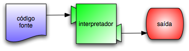
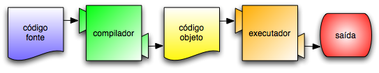

=================================
Capítulo 1: O caminho do programa
=================================

.. contents:: Tópicos

O objetivo deste livro é ensinar o leitor a pensar como um cientista da computação. Essa maneira de pensar combina algumas das melhores características da matemática, da engenharia e das ciências naturais. Como os matemáticos, os cientistas da computação usam linguagens formais para representar ideias (especificamente, computações). Como os engenheiros, eles projetam coisas, montando sistemas a partir de componentes e avaliando as vantagens e desvantagens de diferentes alternativas. Como os cientistas naturais, eles observam o comportamento de sistemas complexos, formulam hipóteses e testam previsões.

A habilidade mais importante de um cientista da computação é a **solução de problemas**. Solução de problemas é a habilidade de formular questões, pensar criativamente sobre soluções possíveis e expressar uma solução de forma clara e precisa. Ocorre que aprender a programar é uma excelente oportunidade de praticar a habilidade da solução de problemas. É por isso que este capítulo se chama "O caminho do programa".

Em certo nível, você estará aprendendo a programar, habilidade que é útil em si mesma. Em outro nível, você usará a programação como um meio para atingir um objetivo. À medida que você for avançando na leitura, esse objetivo ficará mais claro.

-------------------------------------------
1.1	A linguagem de programação Python
-------------------------------------------

Python é a linguagem de programação que você vai estudar neste livro. Python é um exemplo de **linguagem de programação de alto nível**. Outras linguagens de alto nível de que você já pode ter ouvido falar são C++, PHP e Java.

Como você pode deduzir a partir da expressão "linguagem de alto nível", também existem as "linguagens de baixo nível", às vezes chamadas de "linguagens de máquina" ou "linguagem assembly" (linguagens de montagem). De forma simples, o computador só consegue executar programas escritos em linguagens de baixo nível. Deste modo, programas escritos em linguagens de alto nível precisam ser processados antes que possam rodar. Esse processamento extra toma algum tempo, o que é uma pequena desvantagem em relação às linguagens de alto nível.

Mas as vantagens são enormes. Primeiro, é muito mais fácil programar em uma linguagem de alto nível. É mais rápido escrever programas em uma linguagem de alto nível; eles são mais curtos e mais fáceis de ler, e há maior probabilidade de esterem corretos. Segundo, as linguagens de alto nível são **portáveis**, o que significa que podem rodar em diferentes tipos de computador, com pouca ou nenhuma modificação. Programas em baixo nível só podem rodar em um único tipo de computador e precisam ser re-escritos para rodar em outro tipo.

Devido a essas vantagens, quase todos os programas são escritos em linguagens de alto nível. As de baixo nível são utilizadas somente para umas poucas aplicações especializadas.

Dois tipos de programas processam linguagens de alto nível, traduzindo-as em linguagens de baixo nível: **interpretadores** e **compiladores**. O interpretador lê um programa escrito em linguagem de alto nível e o executa, ou seja, faz o que o programa diz. Ele processa o programa um pouco de cada vez, alternadamente: hora lendo algumas linhas, hora executando essas linhas e realizando cálculos.
 

O compilador lê o programa e o traduz completamente antes que o programa comece a rodar. Neste caso, o programa escrito em linguagem de alto nível é chamado de **código fonte**, e o programa traduzido é chamado de **código objeto** ou **executável**. Uma vez que um programa é compilado, você pode executá-lo repetidamente, sem que precise de nova tradução.
 

Python é considerada uma linguagem interpretada, pois os programas em Python são executados por um interpretador. Existem duas maneiras de usar o interpretador: no modo de linha de comando e no modo de script. No modo de linha de comando, você digita programas em Python e o interpretador mostra o resultado::

 $ python
 Python 2.5.2 (r252:60911, Jan  4 2009, 17:40:26) 
 [GCC 4.3.2] on linux2
 Type "help", "copyright", "credits" or "license" for more information.
 >>> print 1 + 1
 2

A primeira linha deste exemplo é o comando que inicia o interpretador Python. As três linhas seguintes são mensagens do interpretador. A quarta linha começa com ``>>>``, que é o sinal usado pelo interpretador para indicar que ele está pronto. No exemplo anterior, digitamos ``print 1 + 1`` e o interpretador respondeu ``2``.

Você também pode escrever um programa em um arquivo e usar o interpretador para executar o conteúdo desse arquivo. Um arquivo como este é chamado de **script**. Por exemplo, usamos um editor de texto para criar um arquivo chamado ``leticia.py`` com o seguinte conteúdo::

  print 1 + 1

Por convenção, arquivos que contenham programas em Python têm nomes que terminam com ``.py``.

Para executar o programa, temos de dizer ao interpretador o nome do script::

  $ python leticia.py
  2

Em outros ambientes de desenvolvimento, os detalhes da execução de programas podem ser diferentes. Além disso, a maioria dos programas são mais interessantes do que esse.

A maioria dos exemplos neste livro são executados a partir da linha de comando. Trabalhar com a linha de comando é conveniente no desenvolvimento e testagem de programas, porque você pode digitar os programas e executá-los imediatamente. Uma vez que você tem um programa que funciona, deve guardá-lo em um script, de forma a poder executá-lo ou modificá-lo no futuro.

------------------------------------
1.2	O que é um programa?
------------------------------------

Um **programa** é uma sequência de instruções que especificam como executar um cálculo ou determinada tarefa. Tal tarefa pode matemática, como solucionar um sistema de equações ou encontrar as raízes de um polinômio, mas também pode ser simbólica, como buscar e substituir uma palavra em um documento ou (estranhamente) compilar um programa.

Os detalhes são diferentes em diferentes linguagens, mas algumas instruções básicas aparecem em praticamente todas as linguagens:

*entrar:*
  Pegar dados do teclado, de um arquivo ou de algum outro dispositivo de entrada.

*sair:*
  Mostrar dados na tela ou enviar dados para um arquivo ou outro dispositivo de saída.

*calcular:*
  Executar operações matemáticas básicas, como adição e multiplicação.

*executar condicionalmente:*
  Checar certas condições e executar a sequência apropriada de instruções.

*repetir:*
  Executar alguma ação repetidamente, normalmente com alguma variação.

Acredite se quiser: isso é praticamente tudo. Todos os programas que você já usou, não importa quão complicados, são feitos de instruções mais ou menos parecidas com essas. Assim, poderíamos definir programação como o processo de dividir uma tarefa grande e complexa em subtarefas cada vez menores, até que as subtarefas sejam simples o suficiente para serem executadas com uma dessas instruções básicas.

Isso pode parecer um pouco vago, mas vamos voltar a esse tópico mais adiante, quando falarmos sobre **algoritmos**.

---------------------------------------------
1.3	O que é depuração (*debugging*)?
---------------------------------------------

Programar é um processo complicado e, como é feito por seres humanos, frequentemente conduz a erros. Por mero capricho, erros em programas são chamados de **bugs** e o processo de encontrá-los e corrigi-los é chamado de **depuração** (*debugging*).

Três tipos de erro podem acontecer em um programa: erros de sintaxe, erros em tempo de execução (*runtime errors*) e erros de semântica (também chamados de erros de lógica). Distinguir os três tipos ajuda a localizá-los mais rápido:

1.3.1 Erros de sintaxe
==========================

O interpretador do Python só executa um programa se ele estiver sintaticamente correto; caso contrário, o processo falha e retorna uma mensagem de erro. **Sintaxe** se refere à estrutura de um programa e às regras sobre esta estrutura. Por exemplo, em português, uma frase deve começar com uma letra maiúscula e terminar com um ponto. 

esta frase contém um **erro de sintaxe**. Assim como esta

Para a maioria dos leitores, uns errinhos de sintaxe não chegam a ser um problema significativo e é por isso que conseguimos ler a poesia moderna de e. e. cummings sem cuspir mensagens de erro. Python não é tão indulgente. Se o seu programa tiver um único erro de sintaxe em algum lugar, o interpretador Python vai exibir uma mensagem de erro e vai terminar - e o programa não vai rodar. Durante as primeiras semanas da sua carreira como programador, você provavelmente perderá um bocado de tempo procurando erros de sintaxe. Conforme for ganhando experiência, entretanto, cometerá menos erros e os localizará mais rápido.

1.3.2 Erros em tempo de execução (*runtime errors*)
=======================================================

O segundo tipo de erro é o erro de *runtime*, ou erro em tempo de execução, assim chamado porque só aparece quando você roda o programa. Esses erros são também conhecidos como **exceções**, porque normalmente indicam que alguma coisa excepcional (e ruim) aconteceu.

Erros de runtime são raros nos programas simples que você vai ver nos primeiros capítulos - então, vai demorar um pouco até você se deparar com um erro desse tipo.

1.3.3 Erros de semântica (ou de lógica)
==========================================

O terceiro tipo de erro é o **erro de semântica** (mais comumente chamado erro de lógica). Mesmo que o seu programa tenha um erro de semântica, ele vai rodar com sucesso, no sentido de que o computador não vai gerar nenhuma mensagem de erro. Só que o programa não vai fazer a coisa certa, vai fazer alguma outra coisa. Especificamente, aquilo que você tiver dito para ele fazer (o computador trabalha assim: seguindo ordens).

O problema é que o programa que você escreveu não é aquele que você queria escrever. O significado do programa (sua semântica ou lógica) está errado. Identificar erros semânticos pode ser complicado, porque requer que você trabalhe de trás para frente, olhando a saída do programa e tentando imaginar o que ele está fazendo.

1.3.4 Depuração experimental (*debugging*)
==============================================

Uma das habilidades mais importantes que você vai adquirir é a de depurar. Embora possa ser frustrante, depurar é uma das partes intelectualmente mais ricas, desafiadoras e interessantes da programação.

De certa maneira, a depuração é como um trabalho de detetive. Você se depara com pistas, e tem que deduzir os processos e eventos que levaram aos resultados que aparecem.

Depurar também é como uma ciência experimental. Uma vez que você tem uma ideia do que está errado, você modifica o seu programa e tenta de novo. Se a sua hipótese estava correta, então você consegue prever o resultado da modificação e fica um passo mais perto de um programa que funciona. Se a sua hipótese estava errada, você tem que tentar uma nova. Como Sherlock Holmes mostrou: "Quando você tiver eliminado o impossível, aquilo que restou, ainda que improvável, deve ser a verdade." (Arthur Conan Doyle, *O signo dos quatro*).

Para algumas pessoas, programação e depuração são a mesma coisa. Ou seja, programar é o processo de gradualmente depurar um programa, até que ele faça o que você quer. A ideia é começar com um programa que faça *alguma coisa* e ir fazendo pequenas modificações, depurando-as conforme avança, de modo que você tenha sempre um programa que funciona.

Por exemplo, o Linux é um sistema operacional que contém milhares de linhas de código, mas começou como um programa simples, que Linus Torvalds usou para explorar o chip Intel 80386. De acordo com Larry Greenfield, "Um dos primeiros projetos de Linus Torvalds foi um programa que deveria alternar entre imprimir AAAA e BBBB. Isso depois evoluiu até o Linux". (*The Linux User's Guide*  Versão Beta 1)

Capítulos posteriores farão mais sugestões sobre depuração e outras práticas de programação.

---------------------------------------------------
1.4	Linguagens naturais e linguagens formais
---------------------------------------------------

**Linguagens naturais** são as linguagens que as pessoas falam, como o português, o inglês e o espanhol. Elas não foram projetadas pelas pessoas (muito embora as pessoas tentem colocar alguma ordem nelas); elas evoluíram naturalmente.

**Linguagens formais** são linguagens que foram projetadas por pessoas, para aplicações específicas. Por exemplo, a notação que os matemáticos usam é uma linguagem formal, que é particularmente boa em denotar relações entre números e símbolos. Os químicos usam uma linguagem formal para representar a estrutura química das moléculas. E, mais importante:

    **Linguagens de programação são linguagens formais que foram desenvolvidas para expressar computações.**

As linguagens formais tendem a ter regras estritas quanto à sintaxe. Por exemplo, **3 + 3 = 6** é uma expressão matemática sintaticamente correta, mas **3=+6$** não é. **H2O** é um nome químico sintaticamente correto, mas **2Zz** não é.

As regras de sintaxe são de dois tipos, um relacionado aos **símbolos**, outro à estrutura. Os símbolos são os elementos básicos da linguagem, como as palavras, números, e elementos químicos. Um dos problemas com **3=+6$** é que **$** não é um símbolo válido em linguagem matemática (pelo menos até onde sabemos). Do mesmo modo, **2Zz** é inválida porque não existe nenhum elemento cuja abreviatura seja **Zz**.

O segundo tipo de erro de sintaxe está relacionado à estrutura de uma expressão, quer dizer, ao modo como os símbolos estão arrumados. A expressão **3=+6$** é estruturalmente inválida, porque você não pode colocar um sinal de "mais" imediatamente após um sinal de "igual". Do mesmo modo, fórmulas moleculares devem ter índices subscritos colocados depois do nome do elemento, não antes.

    Faça este exercício: crie o que pareça ser uma frase bem estruturada em português com símbolos irreconhecíveis dentro dela. Depois escreva outra frase com todos os símbolos válidos, mas com uma estrutura inválida.

Quando você lê uma frase em português ou uma expressão em uma linguagem formal, você tem de imaginar como é a estrutura da frase (embora, em uma linguagem natural, você faça isso inconscientemente). Este processo, na computação, é chamado **parsing** (análise sintática).

Por exemplo, quando você ouve a frase, "Caiu a ficha", entende que "a ficha" é o sujeito e "caiu" é o verbo. Uma vez que você analisou a frase, consegue entender o seu significado, ou a semântica da frase. Assumindo que você saiba o que é uma ficha e o que significa cair, você entenderá o sentido geral dessa frase.

Muito embora as linguagens formais e as naturais tenham muitas características em comum (símbolos, estrutura, sintaxe e semântica), existem muitas diferenças:

*ambiguidade:*
  As linguagens naturais estão cheias de ambiguidades, que as pessoas contornam usando pistas contextuais e outras informações. Já as linguagens formais são desenvolvidas para serem quase ou totalmente desprovidas de ambiguidade, o que significa que qualquer expressão tem precisamente só um sentido, independentemente do contexto.

*redundância:*
  Para compensar a ambiguidade e reduzir maus entendidos, emprega-se muita redundância nas linguagens naturais, o que frequentemente as torna prolixas. As linguagens formais são menos redundantes e mais concisas.

*literalidade:*
  As linguagens naturais estão cheias de expressões idiomáticas e metáforas. Se eu digo "Caiu a ficha", é possível que não exista ficha nenhuma, nem nada que tenha caído. Nas linguagens formais, não há sentido ambíguo.

Pessoas que crescem falando uma linguagem natural, ou seja, todo mundo, muitas vezes têm dificuldade de se acostumar com uma linguagem formal. De certa maneira, a diferença entre linguagens formais e naturais é como a diferença entre poesia e prosa, porém mais acentuada:

*poesia:*
  As palavras são usadas pela sua sonoridade, além de seus sentidos, e o poema como um todo cria um efeito ou uma reação emocional. A ambiguidade não é apenas frequente, mas na maioria das vezes, proposital.

*prosa:*
  O sentido literal das palavras é mais importante, e a estrutura contribui mais para o significado. A prosa é mais fácil de analisar do que a poesia, mas ainda é, muitas vezes, ambígua.

*programas:*
  O significado de um programa de computador é exato e literal, e pode ser inteiramente entendido pela análise de seus símbolos e de sua estrutura.

Aqui vão algumas sugestões para a leitura de programas (e de outras linguagens formais). Primeiro, lembre-se de que linguagens formais são muito mais densas do que linguagens naturais, por isso, é mais demorado lê-las. A estrutura também é muito importante, logo, geralmente não é uma boa ideia ler de cima para baixo, da esquerda para a direita. Em vez disso, aprenda a analisar o programa na sua cabeça, identificando os símbolos e interpretando a estrutura. Finalmente, os detalhes são importantes. Pequenas coisas, como erros ortográficos e má pontuação, com as quais você pode se safar nas linguagens naturais, podem fazer uma grande diferença em uma linguagem formal.

----------------------------------
1.5	O primeiro programa
----------------------------------

Tradicionalmente, o primeiro programa escrito em uma nova linguagem de programação é chamado de "Alô, Mundo!" porque tudo que ele faz é apresentar as palavras "Alô, Mundo!". Em Python, ele é assim::

  print "Alô, Mundo!"

Isso é um exemplo de um **comando print**, que, na realidade, não "imprime" nada em papel. Ele apresenta o valor na tela. Neste caso, o resultado são as palavras::

  Alô, Mundo!

As aspas no programa marcam o começo e o fim do valor, elas não aparecem no resultado final.

Algumas pessoas julgam a qualidade de uma linguagem de programação pela simplicidade do programa "Alô, Mundo!". Por esse padrão, Python se sai tão bem quanto possível.

---------------
1.6 Glossário
---------------

algoritmo (*algorithm*)
  Processo geral para solução de uma certa categoria de problema.
  
análise sintática (*parse*)
  Examinar um programa e analisar sua estrutura sintática.

*bug*
  Erro em um programa.

código fonte (*source code*)
  Um programa em uma linguagem de alto nível, antes de ter sido compilado.
  
código objeto (*object code*)
  A saída do compilador, depois que ele traduziu o programa.

comando `print` (*`print` statement*)
  Instrução que leva o interpretador Python a apresentar um valor na tela.

compilar (*compile*)
  Traduzir todo um programa escrito em uma linguagem de alto nível para uma de baixo nível de uma só vez, em preparação para uma execução posterior.
  
depuração (*debugging*)
  O processo de encontrar e remover qualquer um dos três tipos de erros de programação.

erro de semântica ou lógica (*semantic error*)
  Erro em um programa, que o leva a fazer algo diferente do que pretendia o programador.

erro de sintaxe (*syntax error*)
  Erro em um programa, que torna impossível a análise sintática (logo, também impossível a interpretação).

erro em tempo de execução (*runtime error*)
  Erro que não ocorre até que o programa seja executado, mas que impede que o programa continue.

exceção (*exception*)
  Um outro nome para um erro em tempo de execução ou erro de *runtime*.

executável (*executable*)
  Um outro nome para código objeto que está pronto para ser executado.

interpretar (*interpret*)
  Executar um programa escrito em uma linguagem de alto nível, traduzindo-o uma linha de cada vez.

linguagem de alto nível (*high-level language*)
  Uma linguagem de programação como Python: projetada para ser fácil para os seres humanos utilizarem.

linguagem de baixo nível (*low-level language*)
  Uma linguagem de programação que é concebida para ser fácil para um computador, tal como a linguagem de máquina ou a linguagem montagem (*assembly language*) 

linguagem formal (*formal language*)
  Qualquer linguagem desenvolvida pelas pessoas para propósitos específicos, tais como, a representação de ideias matemáticas ou programas de computadores; todas as linguagens de programação são linguagens formais.

linguagem natural (*natural language*)
  Qualquer língua falada pelos seres humanos que tenha evoluído naturalmente.

portabilidade (*portability*)
  Propriedade que um programa tem de rodar em mais de um tipo de computador. 

programa (*program*)
  Conjunto de instruções que especifica uma computação.

*script*
  Um programa guardado em um arquivo (normalmente um que será interpretado).

semântica (*semantics*)
  O significado de um programa.

símbolo (*token*)
  Um elemento básico da estrutura sintática de um programa, análogo a uma palavra em uma linguagem natural.

sintaxe (*syntax*)
  A estrutura de um programa.

solução de problemas (*problem solving*)
  O processo de formular um problema, encontrar uma solução e expressar esta solução.
