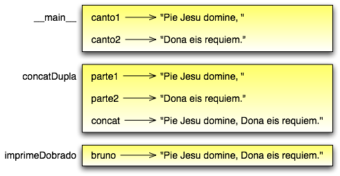

.. $Id: capitulo_03.rst,v 2.2 2007-04-23 22:28:07 luciano Exp $

===================
Capítulo 3: Funções
===================

.. contents:: Tópicos

------------------------------------
3.1 Chamadas de funções
------------------------------------

Você já viu um exemplo de uma **chamada de função**::

  >>> type('32')
  <type 'str'>

O nome da função é ``type`` e ela exibe o tipo de um valor ou variável. O valor ou variável, que é chamado de **argumento** da função, tem que vir entre parênteses. É comum se dizer que uma função 'recebe' um valor ou mais valores e 'retorna' um resultado. O resultado é chamado de **valor de retorno**.

Em vez de imprimir um valor de retorno, podemos atribui-lo a uma variável::

  >>> bia = type('32')
  >>> print bia
  <type 'str'>

Como outro exemplo, a função ``id`` recebe um valor ou uma variável e retorna um inteiro, que atua como um identificador único para aquele valor::

  >>> id(3)
  134882108
  >>> bia = 3
  >>> bia(beth)
  134882108

Todo valor tem um ``id``, que é um número único relacionado ao local onde ele está guardado na memória do computador. O ``id`` de uma variável é o ``id`` do valor a qual ela se refere.

--------------------------------
3.2 Conversão entre tipos
--------------------------------

Python provê uma coleção de funções nativas que convertem valores de um tipo em outro. A função ``int`` recebe um valor e o converte para inteiro, se possível, ou, se não, reclama::

  >>> int('32')
  32
  >>> int('Alô')
  ValueError: invalid literal for int() : Alô

``int`` também pode converter valores em ponto flutuante para inteiro, mas lembre que isso trunca a parte fracionária::

  >>> int(3.99999)
  3
  >>> int(-2.3)
  -2

A função ``float`` converte inteiros e strings em números em ponto flutuante::

  >>> float(32)
  32.0
  >>> float('3.14159')
  3.14159

Finalmente, a função ``str`` converte para o tipo ``string``::

  >>> str(32)
  '32'
  >>> str(3.14149)
  '3.14149'

Pode parecer curioso que Python faça distinção entre o valor inteiro ``1`` e o valor em ponto flutuante ``1.0``. Eles podem representar o mesmo número, mas pertencem a tipos diferentes. A razão é que eles são representados de modo diferente dentro do computador.

---------------------------------------
3.3 Coerção entre tipos
---------------------------------------

Agora que podemos converter entre tipos, temos outra maneira de lidar com a divisão inteira. Voltando ao exemplo do capítulo anterior, suponha que queiramos calcular a fração de hora que já passou. A expressão mais óbvia, ``minuto / 60``, faz aritmética inteira, assim, o resultado é sempre 0, mesmo aos 59 minutos passados da hora.

Uma solução é converter ``minuto`` para ponto flutuante e fazer a divisão em ponto flutuante::

  >>> minuto = 59
  >>> float(minuto) / 60
  0.983333333333

Opcionalmente, podemos tirar vantagem das regras de conversão automática entre tipos, chamada de **coerção de tipos**. Para os operadores matemáticos, se qualquer operando for um ``float``, o outro é automaticamente convertido para ``float``::

  >>> minuto = 59
  >>> minuto / 60.0
  0.983333333333

Fazendo o denominador um ``float``, forçamos o Python a fazer a divisão em ponto flutuante.

----------------------------------------
3.4 Funções matemáticas
----------------------------------------

Em matemática, você provavelmente já viu funções como seno (``sen``, ``sin`` em inglês) e logaritmo (``log``), e aprendeu a resolver expressões como ``sen(pi/2)`` e ``log(1/x)``. Primeiro você resolve e expressão entre parênteses (o argumento). Por exemplo, ``pi/2`` é aproximadamente 1,571, e ``1/x`` é 0.1 (se ``x`` for 10,0).

Aí você avalia a função propriamente dita, seja procurando numa tabela ou realizando vários cálculos. O ``sen`` de 1,571 é 1 e o ``log`` de 0,1 é -1 (assumindo que ``log`` indica o logaritmo na base 10).

Este processo pode ser aplicado repetidamente para avaliar expressões mais complicadas, como ``log(1/sen(pi/2))``. Primeiro você avalia o argumento na função mais interna, depois avalia a função e assim por diante.

Python tem um módulo matemático que provê a maioria das funções matemáticas mais familiares. Um **módulo** é um arquivo que contém uma coleção de funções relacionadas agrupadas juntas.

Antes de podermos usar as funções contidas em um módulo, temos de importá-lo::

  >>> import math

Para chamar uma das funções, temos que especificar o nome do módulo e o nome da função, separados por um ponto. Esse formato é chamado de **notação de ponto**::

  >>> decibel = math.log10(17.0)
  >>> angulo = 1.5
  >>> altura = math.sin(angulo)

A primeira instrução atribui a ``decibel`` o logaritmo de 17 na base 10. Existe também uma função chamada ``log``, usada para calcular o logaritmo em outra base ou o logaritmo natural de um número (base ``e``).

A terceira instrução encontra o seno do valor da variável ``angulo``. ``sin`` e as outras funções trigonométricas (``cos``, ``tan``, etc.) recebem argumentos em radianos. Para converter de graus em radianos, divida por 360 e multiplique por ``2*pi``. Por exemplo, para encontrar o seno de 45 graus, primeiro calcule o ângulo em radianos e depois ache o seno::

  >>> graus = 45
  >>> angulo = graus * 2 * math.pi / 360.0
  >>> math.sin(angulo)
  0.707106781187

A constante pi também é parte do módulo ``math``. Se você sabe geometria, pode checar o resultado anterior comparando-o com a raiz quadrada de dois dividido por dois::

  >>> math.sqrt(2) / 2.0
  0.707106781187

---------------------------------
3.5 Composição
---------------------------------

Do mesmo modo como nas funções matemáticas, as funções do Python podem ser compostas, o que significa que você pode usar uma expressão como parte de outra. Por exemplo, você pode usar qualquer expressão como um argumento para uma função::

  >>> x = math.cos(angulo + pi/2)

Esta instrução toma o valor de ``pi``, divide-o por 2, e soma o resultado ao valor de ``angulo``. A soma é então passada como um argumento para a função ``cos``.

Você também pode pegar o resultado de uma função e passá-lo como um argumento para outra::

  >>> x = math.exp(math.log(10.0))

Esta instrução encontra o logaritmo natural (base ``e``) de 10 e então eleva ``e`` àquela potência. O resultado é atribuído a ``x``.

-----------------------------------------
3.6 Adicionando novas funções
-----------------------------------------

Até aqui, temos utilizado somente as funções que vêm com Python, mas também é possível adicionar novas funções. Criar novas funções para resolver seus próprios problemas é uma das coisas mais úteis de uma linguagem de programação de propósito geral.

No contexto de programação, **função** é uma sequência nomeada de instruções ou comandos, que realizam uma operação desejada. Esta operação é especificada numa **definição de função**. Até agora, as funções que usamos neste livro são pré-definidas e suas definições não foram apresentadas. Isso demonstra que podemos usar funções sem ter que nos preocupar com os detalhes de suas definições.

A sintaxe para uma definição de função é::

  def NOME_DA_FUNCAO( LISTA DE PARAMETROS ) :
    COMANDOS

Você pode usar o nome que quiser para as funções que criar, exceto as palavras reservadas do Python. A lista de parâmetros especifica que informação, se houver alguma, você tem que fornecer para poder usar a nova função.

Uma função pode ter quantos comandos forem necessários, mas eles precisam ser endentados a partir da margem esquerda. Nos exemplos deste livro, usaremos uma endentação de dois espaços.

As primeiras funções que vamos mostrar não terão parâmetros, então, a sintaxe terá esta aparência::

  def novaLinha():
    print

Esta função é chamada de ``novaLinha``. Os parênteses vazios indicam que ela não tem parâmetros. Contém apenas um único comando, que gera como saída um caractere de nova linha (isso é o que acontece quando você usa um comando ``print`` sem qualquer argumento).

A sintaxe para a chamada desta nova função é a mesma sintaxe para as funções nativas::

  print 'Primeira Linha.'
  novaLinha()
  print 'Segunda Linha.'

A saída deste programa é::

  Primeira Linha.

  Segunda Linha.

Observe o espaço extra entre as duas linhas. E se quiséssemos mais espaço entre as linhas? Poderíamos chamar a mesma função repetidamente::

  print 'Primeira Linha.'
  novaLinha()
  novaLinha()
  novaLinha()
  print 'Segunda Linha.'

Ou poderíamos escrever uma nova função chamada ``tresLinhas``, que produzisse três novas linhas::

  def tresLinhas() :
    novaLinha()
    novaLinha()
    novaLinha()

  print 'Primeira Linha.'
  tresLinhas()
  print 'Segunda Linha.'

Esta função contém três comandos, todos com recuo de dois espaços a partir da margem esquerda. Já que o próximo comando não está endentado, Python reconhece que ele não faz parte da função.

Algumas coisas que devem ser observadas sobre este programa:

1.	Você pode chamar o mesmo procedimento repetidamente. Isso é muito comum, além de útil.

2.	Você pode ter uma função chamando outra função; neste caso ``tresLinhas`` chama ``novaLinha``.

Pode não estar claro, até agora, de que vale o esforço de criar novas funções - existem várias razões, mas este exemplo demonstra duas delas:

- Criar uma nova função permite que você coloque nome em um grupo de comandos. As funções podem simplificar um programa ao ocultar a execução de uma tarefa complexa por trás de um simples comando cujo nome pode ser uma palavra em português, em vez de algum código misterioso.

- Criar uma nova função pode tornar o programa menor, por eliminar código repetido. Por exemplo, um atalho para 'imprimir' nove novas linhas consecutivas é chamar ``tresLinhas`` três vezes.

    Como exercício, escreva uma função chamada ``noveLinhas`` que use ``tresLinhas`` para imprimir nove linhas em branco. Como você poderia imprimir vinte e sete novas linhas?

-----------------------------------------
3.7 Definições e uso
-----------------------------------------

Reunindo os fragmentos de código da Seção 3.6, o programa completo fica assim::

  def novaLinha() :
    print

  def tresLinhas() :
    novaLinha()
    novaLinha()
    novaLinha()

  print 'Primeira Linha.'
  tresLinhas()
  print 'Segunda Linha.'

Esse programa contém duas definições de funções: ``novaLinha`` e ``tresLinhas``. Definições de funções são executadas como quaisquer outros comandos, mas o efeito é criar a nova função. Os comandos dentro da definição da função não são executados até que a função seja chamada, logo, a definição da função não gera nenhuma saída.

Como você já deve ter imaginado, é preciso criar uma função antes de poder executá-la. Em outras palavras, a definição da função tem que ser executada antes que ela seja chamada pela primeira vez.

    Como exercício, mova as últimas três linhas deste programa para o topo, de modo que a chamada da função apareça antes das definições. Rode o programa e veja que mensagem de erro você terá.

    Também a título de exercício, comece com a versão que funciona do programa e mova a definição de ``novaLinha`` para depois da definição de ``tresLinhas``. O que acontece quando você roda este programa?

--------------------------------------------
3.8 Fluxo de execução
--------------------------------------------

Para assegurar que uma função esteja definida antes do seu primeiro uso, é preciso saber em que ordem os comandos são executados, ou seja, descobrir qual o **fluxo de execução** do programa.

A execução sempre começa com o primeiro comando do programa. Os comandos são executados um de cada vez, pela ordem, de cima para baixo.

As definições de função não alteram o fluxo de execução do programa, mas lembre-se que comandos dentro da função não são executados até a função ser chamada. Embora não seja comum, você pode definir uma função dentro de outra. Neste caso, a definição mais interna não é executada até que a função mais externa seja chamada.

Chamadas de função são como um desvio no fluxo de execução. Em vez de ir para o próximo comando, o fluxo salta para a primeira linha da função chamada, executa todos os comandos lá e então volta atrás para retomar de onde havia deixado.

Parece muito simples, até a hora em que você lembra que uma função pode chamar outra. Enquanto estiver no meio de uma função, o programa poderia ter de executar os comandos em uma outra função. Mas enquanto estivesse executando esta nova função, o programa poderia ter de executar ainda outra função!

Felizmente, Python é adepto de monitorar a posição onde está, assim, cada vez que uma função se completa, o programa retoma de onde tinha parado na função que a chamou. Quando chega ao fim do programa, ele termina.

Qual a moral dessa história sórdida? Quando você for ler um programa, não o leia de cima para baixo. Em vez disso, siga o fluxo de execução.

----------------------------------------------
3.9 Parâmetros e argumentos
----------------------------------------------

Algumas das funções nativas que você já usou requerem argumentos, aqueles valores que controlam como a função faz seu trabalho. Por exemplo, se você quer achar o seno de um número, você tem que indicar qual número é. Deste modo, ``sin`` recebe um valor numérico como um argumento.

Algumas funções recebem mais de um argumento. Por exemplo, ``pow`` recebe dois argumentos, a base e o expoente. Dentro da função, os valores que lhe são passados são atribuídos a variáveis chamadas **parâmetros**.

Veja um exemplo de uma função definida pelo usuário, que recebe um parâmetro::

  def imprimeDobrado(bruno):
    print bruno, bruno

Esta função recebe um único argumento e o atribui a um parâmetro chamado ``bruno``. O valor do parâmetro (a essa altura, não sabemos qual será) é impresso duas vezes, seguido de uma nova linha. Estamos usando ``bruno`` para mostrar que o nome do parâmetro é decisão sua, mas claro que é melhor escolher um nome que seja mais ilustrativo.

A função ``imprimeDobrado`` funciona para qualquer tipo que possa ser impresso::

  >>> imprimeDoobrado('Spam')
  Spam Spam
  >>> imprimeDobrado(5)
  5 5
  >>> imprimeDobrado(3.14159)
  3.14159 3.14159

Na primeira chamada da função, o argumento é uma string. Na segunda, é um inteiro. Na terceira é um ``float``.

As mesmas regras de composição que se aplicam a funções nativas também se aplicam às funções definidas pelo usuário, assim, podemos usar qualquer tipo de expressão como um argumento para ``imprimeDobrado``::

  >>> imprimeDobrado('Spam'*4)
  SpamSpamSpamSpam SpamSpamSpamSpam
  >>> imprimeDobrado(math.cos(math.pi))
  -1.0 -1.0

Como acontece normalmente, a expressão é avaliada antes da execução da função, assim ``imprimeDobrado`` imprime ``SpamSpamSpamSpam`` ``SpamSpamSpamSpam`` em vez de ``'Spam'*4`` ``'Spam'*4``.

    Como exercício, escreva um chamada a ``imprimeDobrado`` que imprima ``'Spam'*4`` ``'Spam'*4``. Dica: strings podem ser colocadas tanto entre aspas simples quanto duplas e o tipo de aspas que não for usado para envolver a string pode ser usado dentro da string, como parte dela.

Também podemos usar uma variável como argumento::

  >>> miguel = 'Eric, the half a bee.' 
  >>> imprimeDobrado(miguel) 
  Eric, the half a bee. Eric, the half a bee. 

N.T.: "Eric, the half a bee" é uma música do grupo humorístico britânico Monty Python. A linguagem Python foi batizada em homenagem ao grupo e, por isso, os programadores gostam de citar piadas deles em seus exemplos.

Repare numa coisa importante: o nome da variável que passamos como um argumento (``miguel``) não tem nada a ver com o nome do parâmetro (``bruno``). Não importa de que modo o valor foi chamado de onde veio (do 'chamador'); aqui, em ``imprimeDobrado``, chamamos a todo mundo de ``bruno``.

---------------------------------------------
3.10 Variáveis e parâmetros são locais
---------------------------------------------

Quando você cria uma **variável local** dentro de uma função, ela só existe dentro da função e você não pode usá-la fora de lá. Por exemplo::

  def concatDupla(parte1, parte2)
    concat = parte1 + parte2
    imprimeDobrado(concat)

Esta função recebe dois argumentos, concatena-os, e então imprime o resultado duas vezes. Podemos chamar a função com duas strings::

  >>> canto1 = 'Pie Jesu domine, '
  >>> canto2 = 'dona eis requiem. '
  >>> concatDupla(canto1, canto2)
  Pie Jesu domine, Dona eis requiem. Pie Jesu domine, Dona eis requiem.

Quando a função ``concatDupla`` termina, a variável ``concat`` é destruída. Se tentarmos imprimi-la, teremos um erro::

  >>> print concat
  NameError: concat

Parâmetros são sempre locais. Por exemplo, fora da função ``imprimeDobrado``, não existe nada que se chama ``bruno``. Se você tentar utilizá-la, o Python vai reclamar.

-------------------------------------
3.11 Diagramas da pilha
-------------------------------------

Para entender que variáveis podem ser usadas aonde, às vezes é útil desenhar um **diagrama da pilha**. Como os diagramas de estado, diagramas da pilha mostram o valor de cada variável, mas também a função à qual cada variável pertence.

Cada função é representada por um **quadro**. Um quadro é uma caixa com o nome de uma função ao lado dela e os parâmetros e variáveis da função dentro dela. O diagrama de pilha para o exemplo anterior tem a seguinte aparência:

A ordem da pilha mostra o fluxo de execução. ``imprimeDobrado`` foi chamado por ``concatDupla``, e ``concatDupla`` foi chamado por ``__main__`` (principal), que é um nome especial para a função mais no topo. Quando você cria uma variável fora de qualquer função, ela pertence à ``__main__``.

Cada parâmetro se refere ao mesmo valor que o seu argumento correspondente. Assim, ``parte1`` tem o mesmo valor de ``canto1``, ``parte2`` tem o mesmo valor de ``canto2`` e ``bruno`` tem o mesmo valor de ``concat``.

Se um erro acontece durante uma chamada de função, Python imprime o nome da função, e o nome da função que a chamou, e o nome da função que chamou a que chamou, percorrendo todo o caminho de volta a ``__main__``.

Por exemplo, se tentássemos acessar ``concat`` de dentro de ``imprimeDobrado``, teríamos um ``NameError``::

  Traceback (innermost last):
    File "teste.py", line 13, in __main__
      concatDupla(canto1, canto2)
    File "teste.py", line 5, in concatDupla
      imprimeDobrado(concat)
    File "teste.py", line 9, in imprimeDobrado
      print concat
  NameError: concat
 
Esta lista de funções é chamada de **traceback**. Ela mostra em qual arquivo de programa o erro ocorreu, em que linha, e quais funções estavam sendo executadas naquele momento. Mostra também a linha de código que causou o erro.

Note a similaridade entre o traceback e o diagrama da pilha. Não é coincidência.

-------------------------------------------
3.12 Funções com resultados
-------------------------------------------

A essa altura, você deve ter percebido que algumas das funções que estamos usando, tais como as funções matemáticas, produzem resultados. Outras funções, como ``novaLinha``, executam uma ação, mas não retornam um valor. O que levanta algumas questões:

1.	O que acontece se você chama uma função e não faz nada com o resultado (por exemplo, não atribui o resultado a uma variável ou o usa como parte de uma expressão maior)?

2.	O que acontece se você usa uma função que não produz resultado em uma expressão tal como ``novaLinha() + 7``?

3.	Você pode escrever funções que produzem resultados, ou está preso a funções como ``novaLinha`` e ``imprimeDobrado``?

A resposta para a terceira questão é afirmativa e nós vamos fazer isso no Capítulo 5.

    A título de exercício, responda as outras duas questões testando-as. Se tiver dúvida sobre o que é válido ou inválido em Python, tente buscar a resposta perguntando ao interpretador.

-------------------------
3.13 Glossário
-------------------------

argumento (*argument*)
  Valor fornecido a uma função quando ela é chamada. Este valor é atribuído ao parâmetro correspondente na função.

chamada de função (*function call*)
  Comando que executa uma função. Consiste do nome da função seguido de uma lista de argumentos entre parênteses. 

coerção de tipo (*type coercion*)
  Uma coerção de tipo que ocorre automaticamente, de acordo com as regras de coercividade do Python.

conversão de tipo (*type conversion*)
  Comando explícito que pega um valor de um tipo e devolve o valor correspondente em outro tipo.

definição de função (*function definition*)
  Comando que cria uma nova função, especificando seu nome, parâmetros e comandos que ela executa.

diagrama da pilha (*stack diagram*)
  Representação gráfica da pilha de funções, suas variáveis e os valores aos quais elas se referem.

fluxo de execução (*flow of execution*)
  A ordem na qual os comandos são executados durante a execução do programa.

*frame* 
  Retângulo no diagrama da pilha que representa uma chamada de função. Contém as variáveis locais e os parâmetros da função.

função (*function*)
  Sequência de comandos nomeada, que realiza alguma tarefa útil. As funções podem ou não receber parâmetros e podem ou não retornar valores.

módulo (*module*)
  Arquivo que contém uma coleção de funções e classes relacionadas entre si.

notação de ponto (*dot notation*)
  A sintaxe para chamar uma função que está em outro módulo, especificando o nome do módulo, seguido por um ponto (.) e o nome da função.

parâmetro (*parameter*)
  Nome usado numa função para referir-se a um valor passado como argumento.

*traceback* 
  Lista de funções que estão em execução, impressa quando um erro de execução ocorre.

valor de retorno (*return value*)
  O resultado da função. Se uma chamada de função é usada como expressão, o valor de retorno é o valor da expressão.

variável local (*local variable*)
  Variável definida dentro da função. Uma variável local só pode ser usada dentro da função onde foi definida.
