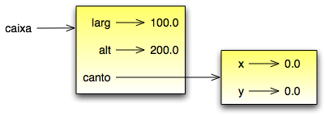
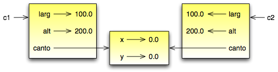

.. $Id: capitulo_12.rst,v 2.8 2007-04-24 17:32:07 luciano Exp $

==============================
Capítulo 12: Classes e objetos
==============================

.. contents:: Tópicos

---------------------------------------------
12.1 Tipos compostos definidos pelo usuário
---------------------------------------------

Depois de usarmos alguns tipos nativos do Python, estamos prontos para criar um tipo de dados: o ``Ponto``.

Considere o conceito matemático de um ponto. Em duas dimensões, um ponto é um par de números (coordenadas) que são tratadas coletivamente como um objeto simples. Na notação matemática, pontos são freqüentemente escritos entre parênteses com vírgula separando as coordenadas. Por exemplo, (0, 0) representa a origem, e (*x*, *y*) representa o ponto *x* unidades à direita, e *y* unidades acima da origem.

Uma maneira natural para representar um ponto em Python, é com dois valores numéricos em ponto flutuante. A questão, então, é como agrupar estes dois valores em um objeto composto. A maneira rápida e rasteira é usar uma lista ou uma tupla, e para algumas aplicações, esso pode ser a melhor escolha [#]_.

.. [#] **N.T.**: A linguagem Python também incorpora um tipo nativo ``complex`` que representa números complexos. Uma instância de ``complex``, como ``a=3+5j`` possui dois valores de ponto flutuante em seus atributos ``a.real`` e ``a.imag``, e pode ser utilizada para armazenar pontos em um espaço bi-dimensional.

Uma alternativa é definir um novo tipo composto, também chamado uma **classe**. Esta abordagem envolve um pouco mais de esforço, mas ela tem vantagens que logo ficarão evidentes.
 
Eis a definição de uma classe::

  class Ponto:
    pass

Definições de classes podem aparecer em qualquer parte de um programa, mas elas costuma ficar próximas do começo do programa (após os comandos ``import``). As regras de sintaxe para a definição de classes são as mesmas de outros comandos compostos (veja Seção 4.4).

A definição acima cria uma nova classe chamada ``Ponto``. O comando 
``pass`` não tem nenhum efeito; aqui ele é necessário porque um comando composto precisa ter algo no seu corpo.

Quando criamos a classe ``Ponto``, criamos um novo tipo de dado, também chamado ``Ponto``. Os membros deste novo tipo são chamados **instâncias**  deste tipo ou **objetos**. Criar uma nova instância é **instanciar**. Para instanciar o objeto ``Ponto``, invocamos a função (adivinhou?) ``Ponto``::

  final = Ponto()

A variável ``final`` agora contém uma referência a um novo objeto da classe ``Ponto``. Uma função como ``Ponto``, que cria novos objetos, é chamada **construtor**.

----------------
12.2 Atributos
----------------

Podemos adicionar novos dados em uma instância usando a notação de ponto (*dot notation*)::

  >>> final.x = 3.0
  >>> final.y = 4.0

Esta sintaxe é similar à sintaxe para acessar uma variável de um módulo, como ``math.pi`` ou ``string.uppercase``. Neste caso, porém, estamos acessando um item de dado de uma instância. Estes itens são chamados **atributos**.

O seguinte diagrama de estado mostra o resultado destas atribuições:

.. image:: fig/12_01_ponto.png

A variável ``final`` refere a um objeto ``Ponto``, que contém dois atributos. Cada atributo faz referência a um número em ponto flutuante.

Podemos ler o valor de um atributo usando a mesma sintaxe::

  >>> print final.y
  4.0
  >>> x = final.x
  >>> print x
  3.0

A expressão ``final.x`` significa, "Vá ao objeto ``final`` e pegue o valor de ``x``". Neste caso,  atribuímos este valor a uma variável cujo nome é 'x'. Não há conflito entre a variável ``x`` e o atributo ``x``. O propósito da notação ``objeto.atributo`` é identificar a qual variável você está fazendo referência de forma que não é ambíguo.

Você pode usar a notação ``objeto.atributo`` como parte de qualquer expressão; assim os seguintes comandos são válidos::

  print '(' + str(final.x) + ', ' + str(final.y) + ')'
  distAoQuadrado = final.x * final.x + final.y * final.y

A primeira linha imprime (3.0, 4.0); a segunda linha calcula o valor 25.0.

É tentador imprimir o valor do próprio objeto ``final``::

  >>> print final
  <__main__.Ponto instance at 80f8e70>

O resultado indica que ``final`` é uma instância da classe ``Ponto`` e foi definida no prgrama principal: ``__main__``. 80f8e70 é o identificador único deste objeto, escrito em hexadecimal (base 16). Esta não é provavelmente a forma mais informativa para mostrar um objeto ``Ponto``. Logo você irá ver como mudar isso. 

  Como exercício, crie e imprima um objeto Ponto, e então use ``id`` para imprimir o identificador único do objeto. Traduza a forma hexadecimal para a forma decimal e confirme se são compatíveis.

---------------------------------
12.3 Instâncias como parâmetros
---------------------------------

Você pode passar uma instância como um parâmetro da forma usual. Por exemplo::

  def mostrarPonto(p):
    print '(' + str(p.x) + ', ' + str(p.y) + ')'

A função ``mostrarPonto`` pega o ponto (p) como um argumento e mostra-o no formato padrão. Se você chamar ``mostrarPonto(final)``, a saída será (3.0, 4.0).
  
  Como um exercício, re-escreva a função distância da Seção 5.2 para receber dois pontos como parâmetros, ao invés de quatro números.

-------------------------------
12.4 O significado de "mesmo"
-------------------------------

O significado da palavra "mesmo" parece perfeitamente claro até que você pense a respeito, e então você percebe que há mais nesta palavra do que você esperava.

Por exemplo, se você diz "Cris e eu temos o mesmo carro", você está dizendo que o carro de Cris e o seu são do mesmo fabricante e modelo, mas são dois carros diferentes. Se você disser "Cris e eu temos a mesma mãe", você está dizendo que a mãe de Cris e a sua, são a mesma pessoa [#]_. Portanto a idéia de 'semelhança' é diferente dependendo do contexto.

.. [#] Nem todos os idiomas têm este problema. Por exemplo, em alemão há palavras diferentes para diferentes sentidos de "mesmo". "Mesmo carro" nesse contexto seria "gleiche Auto", e "mesma mãe" seria "selbe Mutter".

Quando falamos de objetos, há uma ambigüidade similar. Por exemplo, se dois Pontos forem os mesmos, isto quer dizer que eles contêm os mesmos dados (coordenadas) ou que são realmente o "mesmo" objeto?

Para verificar se duas referências se referem ao 'mesmo' objeto, use o operador '==' [#]_. Por exemplo::

  >>> p1 = Ponto()
  >>> p1.x = 3
  >>> p1.y = 4
  >>> p2 = Ponto()
  >>> p2.x = 3
  >>> p2.y = 4
  >>> p1 == p2
  False

.. [#] XXX LR: Eu não diria que devemos usar == para verificar se dois objetos são o mesmo. Isto é uma falha do livro que talvez se origine no original que falava de Java. Em Python o operador is faz o mesmo que o == de Java: compara referências, e portanto serve para determinar se duas variáveis apontam para o mesmo objeto. No entanto, a o código acima está correto porque em Python a implemetação default de == (método __eq__) é comparar o id das instâncias, porém as classes list e dict, por exemplo, implementam __eq__ comparando os valores contidos (ex.: isto retorna True: l1 = [1,2,3]; l2 = [1,2,3]; l1 == l2).

Mesmo que p1 e p2 contenham as mesmas coordenadas, os dois não representam o mesmo objeto. Se atribuirmos p1 a p2, então as duas variáveis são pseudônimos do mesmo objeto.

::

  >>> p2 = p1
  >>> p1 == p2
  True

Este tipo de igualdade é chamado de igualdade rasa porque ela compara somente as referências e não o conteúdo dos objetos.

Para comparar o conteúdo dos objetos -- igualdade profunda -- podemos escrever uma função chamada mesmoPonto::

  def mesmoPonto(p1, p2) :
    return (p1.x == p2.x) and (p1.y == p2.y)

Agora se criarmos dois diferentes objetos que contém os mesmos dados, podemos usar mesmoPonto para verificar se eles representam o mesmo ponto.

::

  >>> p1 = Ponto()
  >>> p1.x = 3
  >>> p1.y = 4
  >>> p2 = Ponto()
  >>> p2.x = 3
  >>> p2.y = 4
  >>> mesmoPonto(p1, p2)
  True

É claro, se as duas variáveis referirem ao mesmo objeto, elas têm igualdade rasa e igualdade profunda.  

----------------
12.5 Retângulos
----------------

Digamos que desejemos uma classe para representar um retângulo. A questão é, qual informação temos de prover para especificar um retângulo? Para manter as coisas simples, assuma que o retângulo é orientado verticalmente ou horizontalmente, nunca em um ângulo.

Há algumas possibilidades: poderíamos especificar o centro do retângulo (duas coordenadas) e seu tamanho (largura e altura); ou poderíamos especificar um dos lados e o tamanho; ou poderíamos especificar dois lados opostos. A escolha convencional é especificar o canto superior esquerdo do retângulo e o tamanho.

Novamente, vamos definir uma nova classe::

  class Rectangle:
    pass

E instanciá-la::

  box = Rectangle()
  box.width = 100.0
  box.height = 200.0

Este código cria um novo objeto Retângulo com dois atributos ponto-flutuante. Para especificar o canto superior esquerdo, podemos embutir um objeto dentro de um objeto!

::

  box.corner = Ponto()
  box.corner.x = 0.0;
  box.corner.y = 0.0;

A expressão box.corner.x significa, "vá ao objeto referenciado por 'box' e selecione o atributo 'corner'; então vá ao objeto 'corner' e deste, selecione o atributo de nome 'x'".

A figura mostra o estado deste objeto:

-----------------------------------------
12.6 Instancias como valores retornados
-----------------------------------------
 
Funções podem retornar instâncias. Por exemplo, findCenter pega um Retângulo como um argumento e retorna um Ponto que contem as coordenadas do centro do retângulo::
 
  def findCenter(box):
	p = Ponto()
	p.x = box.corner.x + box.width/2.0
	p.y = box.corner.y + box.height/2.0

Para chamar esta função, passe 'box' como um argumento e coloque o resultado em uma variável.

::

  >>> center = findCenter(box)
  >>> print mostrarPonto(center)
  (50.0, 100.0)
 
--------------------------- 
12.7 Objetos são mutáveis
---------------------------

Podemos mudar o estado de um objeto fazendo uma atribuição a um dos seus atributos. Por exemplo, para mudar o tamanho de um retângulo sem mudar sua posição, podemos modificar os valores de sua largura e altura. Veja::
 
  box.width = box.width + 50
  box.height = box.height + 100
 
Poderíamos encapsular este código em um método e generaliza-lo para aumentar o tamanho deste retângulo em qualquer medida::

  def growRect(box, dwidth, dheight) :
	box.width = box.width + dwidth
	box.height = box.height + dheight

As variáveis dwidth e dheight indicam em quanto vamos aumentar o tamanho do retângulo em cada direção. Chamando este método, teríamos o mesmo efeito.

Por exemplo, poderíamos criar um novo Retângulo com o nome de 'bob' e passar este nome para o método growRect::

  >>> bob = Rectangle()
  >>> bob.width = 100.00
  >>> bob.height = 200.00
  >>> bob.corner.x = 0.0;
  >>> bob.corner.y = 0.0;
  >>> growRect(bob, 50, 100)

Enquanto growRect está sendo executado, o parâmetro 'box' é um alias (apelido) para 'bob'. Qualquer mudança feita em 'box', também irá afetar 'bob'.

Como exercício, escreva uma function (método) com o nome de moveRect que pega um Rectangle e dois parâmetros com o nome de 'dx' e 'dy'. Esta função deverá mudar a localização do retângulo através da adição de 'dx' à coordenada 'x' e da adição de 'dy' à coordenada 'y'.

---------------
12.8 Copiando
---------------

Ao usar 'alias' - como fizemos na seção anterior - podemos tornar o programa um pouco difícil de ler ou entender, pois as mudanças feitas em um local, podem afetar inesperadamente um outro objeto. E pode se tornar difícil de encontrar todas as variáveis que podem afetar um dado objeto.

Copiar um objeto é freqüentemente uma alternativa ao 'alias'. O modulo 'copy' contém uma função chamada 'copy' que duplica um qualquer objeto. Veja::

  >>> import copy
  >>> p1 = Ponto()
  >>> p1.x = 3
  >>> p1.y = 4
  >>> p2 = copy.copy(p1)
  >>> p1 == p2
  0
  >>> mesmoPonto(p1, p2)
  1

Uma vez que importamos o modulo 'copy', podemos usar o método 'copy' para criar um outro 'Ponto'. p1 e p2 não representam o mesmo ponto, mas eles contem os mesmo dados.

Para copiar um simples objeto como um 'Ponto', que não contem nenhum objeto embutido, 'copy' é suficiente. Isto eh chamado 'shallow' copia.

Mas para um objeto como um 'Rectangle', que contem uma referencia para um 'Ponto', o método 'copy' não irá executar corretamente a copia. Ele irá copiar a referencia para o objeto 'Ponto', portanto o que acontece aqui é que os dois Rectangle (o novo e o antigo) irão fazer referencia a um simples 'Ponto'.

Em outras palavras, se criarmos um 'box', c1, utilizando a forma usual, e depois fazer uma copia, c2, usando o método 'copy', o diagrama de estado resultante ficará assim:

o resultado não será o que esperamos. Neste caso, invocando 'growRect' em um dos retângulos (c1), isto não irá afetar o outro retângulo (c2, neste exemplo). Mas se usarmos o método 'moveRect' em qualquer um deles, isto irá inevitavelmente afetar o outro. Este comportamento é confuso e propenso a erros!

Mas felizmente o modulo 'copy' contem um método chamado 'deepcopy' que copia não somente o objeto, mas também copia todo e qualquer objeto 'embutido' neste objeto. Por isto, você não ficará surpreso porque este método chama-se 'deepcopy' (copia profunda) não é? Veja como funciona::

  >>> c2 = copy.deepcopy(c1)

Agora, c1 e c2 são objetos completamente separados.

Podemos usar 'deepcopy' para re-escrever 'growRect' sendo que ao invés de modificar um Rectangle existente, ele cria um novo que tem a mesma localização do outro, mas com novas dimensões::

  def growRect(box, dwidth, dheight):
    import copy
    newBox = copy.deepcopy(box)
    newBox.width = newBox.width + dwidth
    newBox.height = newBox.height + dheight
    return newBox

Como exercício, re-escreva o método 'moveRect' para ele criar e retornar um novo Rectangle ao invés de apenas modificar o antigo.

---------------
12.9 Glossário
---------------

classe (*class*)
    Um tipo composto (XXX compound type) definido pelo usuário. Uma classe também pode ser visualizada como um molde que define a forma dos objetos que serão suas instâncias.
    
instanciar (*instantiate*)
    Criar uma instância de uma classe.
    
instância (*instance*)
    Um objeto que pertence a uma classe.
    
objeto (*object*)
    Um tipo de dado composto comumente utilizado para representar uma coisa ou um conceito do mundo real.

construtor (*constructor*)
    Um método utilizado para criar novos objetos.
    
atributo (*attribute*)
    Um dos itens de dados nomeados que compõem uma instância.

igualdade rasa (*shallow equality*)
    Igualdade de referências; ocorre quando duas referências apontam para o mesmo objeto.
    
igualdade profunda (*deep equality*)
    Igualdade de valores; ocorre quando duas referências apontam para objetos que têm o mesmo valor.

cópia rasa (*shallow copy*)
    Ato de copiar o conteúdo de um objeto, incluindo as referências a objetos embutidos (XXX embedded); implementada pela função ``copy`` do módulo ``copy``.

cópia profunda (*deep copy*)
    Ato de copiar o conteúdo de um objeto, bem como dos objetos embutidos (XXX embedded), e dos objetos embutidos nestes, e assim por diante; implementada pela função ``deepcopy`` do módulo ``copy``.
    
    
