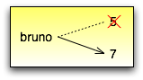

.. $Id: capitulo_06.rst,v 2.2 2007-04-23 22:28:08 luciano Exp $

====================
Capítulo 6: Iteração
====================

.. contents:: Tópicos

---------------------------
6.1 Reatribuições
---------------------------

Como você talvez já tenha descoberto, é permitido fazer mais de uma atribuição à mesma variável. Uma nova atribuição faz uma variável existente referir-se a um novo valor (sem se referir mais ao antigo).::

  bruno = 5
  print bruno,
  bruno = 7
  print bruno

A saída deste programa é ``5`` ``7``, porque na primeira vez que ``bruno`` é impresso, seu valor é 5 e na segunda vez, seu valor é 7. A vírgula no final do primeiro comando ``print`` suprime a nova linha no final da saída, que é o motivo pelo qual as duas saídas aparecem na mesma linha.

Veja uma **reatribuição** em um diagrama de estado:

Com a reatribuição torna-se ainda mais importante distinguir entre uma operação de atribuição e um comando de igualdade. Como Python usa o sinal de igual ( ``=`` ) para atribuição, existe a tendência de lermos um comando como ``a = b`` como um comando de igualdade. Mas não é!

Em primeiro lugar, igualdade é comutativa e atribuição não é. Por exemplo, em matemática, se a = 7 então 7 = a. Mas em Python, o comando ``a = 7`` é permitido e ``7 = a`` não é.

Além disso, em matemática, uma expressão de igualdade é sempre verdadeira. Se a = b agora, então, a será sempre igual a b. Em Python, um comando de atribuição pode tornar duas variáveis iguais, mas elas não têm que permanecer assim::

  a = 5
  b = a # a e b agora são iguais
  b = 3 # a e b não são mais iguais

A terceira linha muda o valor de ``a`` mas não muda o valor de ``b``, então, elas não são mais iguais. (Em algumas linguagens de programação, um símbolo diferente é usado para atribuição, como ``<-`` ou ``:=``, para evitar confusão.)

Embora a reatribuição seja freqüentemente útil, você deve usá-la com cautela. Se o valor das variáveis muda freqüentemente, isto pode fazer o código difícil de ler e de depurar.

----------------------------
6.2 O comando ``while``
----------------------------

Os computadores são muito utilizados para automatizar tarefas repetitivas. Repetir tarefas idênticas ou similares sem cometer erros é uma coisa que os computadores fazem bem e que as pessoas fazem poorly.

Vimos dois programas, ``nLinhas`` e ``contagemRegressiva``, que usam recursividade (recursão) para fazer a repetição, que também é chamada **iteração**. Porque a iteração é muito comum, Python tem várias características para torná-la mais fácil. A primeira delas em que vamos dar uma olhada é o comando ``while``.

Aqui está como fica ``contagemRegressiva`` com um comando ``while``::

  def contagemRegressiva(n):
    while n > 0:
      print n
      n = n-1
    print "Fogo!"

Desde que removemos a chamada recursiva, esta função não é recursiva.

Você quase pode ler o comando ``while`` como se fosse Inglês. Ele significa, "Enquanto (while) ``n`` for maior do que ``0``, siga exibindo o valor de ``n`` e diminuindo ``1`` do valor de ``n``. Quando chegar a ``0``, exiba a palavra ``Fogo!``".

Mais formalmente, aqui está o fluxo de execução para um comando ``while``:

1. Teste a condição, resultando 0 ou 1.

2. Se a condição for falsa (0), saia do comando while e continue a execução a partir do próximo comando.

3. Se a condição for verdadeira (1), execute cada um dos comandos dentro do corpo e volte ao passo 1.

O corpo consiste de todos os comandos abaixo do cabeçalho, com a mesma endentação.

Este tipo de fluxo é chamado de um **loop** (ou laço) porque o terceiro passo cria um "loop" ou um laço de volta ao topo. Note que se a condição for falsa na primeira vez que entrarmos no loop, os comandos dentro do loop jamais serão executados.

O corpo do loop poderia alterar o valor de uma ou mais variáveis de modo que eventualmente a condição se torne falsa e o loop termine. Se não for assim, o loop se repetirá para sempre, o que é chamado de um **loop infinito**. Uma fonte de diversão sem fim para os cientistas da computação é a observação de que as instruções da embalagem de shampoo, "Lave, enxágüe, repita" é um loop infinito.

No caso de ``contagemRegressiva``, podemos provar que o loop terminará porque sabemos que o valor de n é finito, e podemos ver que o valor de n diminui dentro de cada repetição (iteração) do loop, então, eventualmente chegaremos ao 0. Em outros casos, isto não é tão simples de afirmar::

  def sequencia(n):
    while n != 1:
      print n,
      if n%2 == 0:      # n é par
        n = n/2
      else:         # n é impar
        n = n*3+1

A condição para este loop é ``n != 1``, então o loop vai continuar até que ``n`` seja ``1``, o que tornará a condição falsa.

Dentro de cada repetição (iteração) do loop, o programa gera o valor de ``n`` e então checa se ele é par ou impar. Se ele for par, o valor de ``n`` é dividido por ``2``. Se ele for impar, o valor é substituído por ``n*3+1``. Por exemplo, se o valor inicial (o argumento passado para ``seqüência``) for 3, a seqüência resultante será ``3``, ``10``, ``5``, ``16``, ``8``, ``4``, ``2``, ``1``.

Já que ``n`` às vezes aumenta e às vezes diminui, não existe uma prova óbvia de que ``n`` jamais venha a alcançar 1, ou de que o programa termine. Para alguns valores particulares de ``n``, podemos provar o término. Por exemplo, se o valor inicial for uma potência de dois, então o valor de ``n`` será par dentro de cada repetição (iteração) do loop até que alcance 1. O exemplo anterior termina com uma dessas seqüências começando em 16.

Valores específicos à parte, A questão interessante é se há como provarmos que este programa termina para todos os valores de ``n``. Até hoje, ninguém foi capaz de provar que sim ou que não!

Como um exercício, reescreva a função ``nLinhas`` da seção 4.9 usando iteração em vez de recursão.

---------------
6.3 Tabelas
---------------

Uma das coisas para qual os loops são bons é para gerar dados tabulares. Antes que os computadores estivessem readily disponíveis, as pessoas tinham que calcular logaritmos, senos, cossenos e outras funções matemáticas à mão. Para tornar isto mais fácil, os livros de matemática continham longas tabelas listando os valores destas funções. Criar as tabelas era demorado e entediante, e elas tendiam a ser cheias de erros.

Quando os computadores entraram em cena, uma das reações iniciais foi "Isto é ótimo! Podemos usar computadores para geras as tabelas, assim não haverá erros." Isto veio a se tornar verdade (na maioria das vezes) mas shortsighted. Rapidamente, porém, computadores e calculadoras tornaram-se tão pervasivos que as tabelas ficaram obsoletas.

Bem, quase. Para algumas operações, os computadores usam tabelas de valores para conseguir uma resposta aproximada e então realizar cálculos para melhorar a aproximação. Em alguns casos, têm havido erros nas tabelas underlying, o caso mais famoso sendo o da tabela usada pelo processador Pentium da Intel para executar a divisão em ponto-flutuante.

Embora uma tabela de logaritmos não seja mais tão útil quanto já foi um dia, ela ainda dá um bom exemplo de iteração. O seguinte programa gera uma seqüência de valores na coluna da esquerda e seus respectivos logaritmos na coluna da direita::

  import math

  x = 1.0
  while x < 10.0:
    print x, '\t', math.log(x)
    x = x + 1.0

A string ``'\t'`` representa um caracter de **tabulação**.

Conforme caracteres e strings vão sendo mostrados na tela, um ponteiro invisível chamado **cursor** marca aonde aparecerá o próximo caractere. Depois de um comando ``print``, o cursor normalmente vai para o início de uma nova linha.

O caractere de tabulação desloca o cursor para a direita até que ele encontre uma das marcas de tabulação. Tabulação é útil para fazer colunas de texto line up, como na saída do programa anterior::

  1.0   0.0
  2.0   0.69314718056
  3.0   1.09861228867
  4.0   1.38629436112
  5.0   1.60943791243
  6.0   1.79175946923
  7.0   1.94591014906
  8.0   2.07944154168
  9.0   2.19722457734

Se estes valores parecem odd, lembre-se que a função ``log`` usa a base ``e``. Já que potências de dois são tão importantes em ciência da computação, nós freqüentemente temos que achar logaritmos referentes à base 2. Para fazermos isso, podemos usar a seguinte fórmula:

(XXX diagramar fórmula matemática)

log2 x = loge x         (6.1)
                         loge 2

Alterando o comando de saída para::

  print x, '\t', math.log(x)/math.log(2.0)

o que resultará em::

  1.0   0.0
  2.0   1.0
  3.0   1.58496250072
  4.0   2.0
  5.0   2.32192809489
  6.0   2.58496250072
  7.0   2.80735492206
  8.0   3.0
  9.0   3.16992500144

Podemos ver que 1, 2, 4 e 8 são potências de dois porque seus logaritmos na base 2 são números redondos. Se precisássemos encontrar os logaritmos de outras potências de dois, poderíamos modificar o programa deste modo::

  x = 1.0
  while x < 100.0:
    print x, '\t', math.log(x)/math.log(2.0)
    x = x * 2.0

Agora, em vez de somar algo a x a cada iteração do loop, o que resulta numa seqüência aritmética, nós multiplicamos x por algo, resultando numa seqüência geométrica. O resultado é::

  1.0   0.0
  2.0   1.0
  4.0   2.0
  8.0   3.0
  16.0  4.0
  32.0  5.0
  64.0  6.0

Por causa do caractere de tabulação entre as colunas, a posição da segunda coluna não depende do número de dígitos na primeira coluna.

Tabelas de logaritmos podem não ser mais úteis, mas para cientistas da computação, conhecer as potências de dois é!

Como um exercício, modifique este programa de modo que ele produza as potências de dois acima de 65.535 (ou seja, 216). Imprima e memorize-as.

O caractere de barra invertida em ``'\t'`` indica o início de uma seqüência de escape. Seqüências de escape são usadas para representar caracteres invisíveis como de tabulação e de nova linha. A seqüência ``\n`` representa uma nova linha.

Uma seqüência de escape pode aparecer em qualquer lugar em uma string; no exemplo, a seqüência de escape de tabulação é a única coisa dentro da string.

Como você acha que se representa uma barra invertida em uma string?

Como um exercício, escreva um única string que

produza
    esta
        saída.

--------------------------------------------------------
6.4 Tabelas de duas dimensões (ou bi-dimensionais)
--------------------------------------------------------

Uma tabela de duas dimensões é uma tabela em que você lê o valor na interseção entre uma linha e uma coluna. Uma tabela de multiplicação é um bom exemplo. Digamos que você queira imprimir uma tabela de multiplicação de 1 a 6.

Uma boa maneira de começar é escrever um loop que imprima os múltiplos de 2, todos em uma linha::

  i = 1
  while i <= 6:
    print 2*i, '   ',
    i = i + 1
  print

A primeira linha inicializa a variável chamada ``i``, a qual age como um contador ou **variável de controle do loop**. Conforme o loop é executado, o valor de ``i`` é incrementado de 1 a 6. Quando ``i`` for 7, o loop termina. A cada repetição (iteração) do loop, é mostrado o valor de ``2*i``, seguido de três espaços.

De novo, a vírgula no comando ``print`` suprime a nova linha. Depois que o loop se completa, o segundo comando ``print`` inicia uma nova linha.

A saída do programa é::

  2     4     6     8     10     12

Até aqui, tudo bem. O próximo passo é **encapsular** e **generalizar**.

------------------------------------------
6.5 Encapsulamento e generalização
------------------------------------------

Encapsulamento é o processo de wrapping um pedaço de código em uma função, permitindo que você tire vantagem de todas as coisas para as quais as funções são boas. Você já viu dois exemplos de encapsulamento: ``imprimeParidade`` na seção 4.5; e ``eDivisivel`` na seção 5.4

Generalização significa tomar algo que é específico, tal como imprimir os múltiplos de 2, e torná-lo mais geral, tal como imprimir os múltiplos de qualquer inteiro.

Esta função encapsula o loop anterior e generaliza-o para imprimir múltiplos de n::

  def imprimeMultiplos(n):
  i = 1
  while i <= 6:
    print n*i, '\t ',
    i = i + 1
  print

Para encapsular, tudo o que tivemos que fazer foi adicionar a primeira linha, que declara o nome de uma função e sua lista de parâmetros. Para generalizar, tudo o que tivemos que fazer foi substituir o valor 2 pelo parâmetro ``n``.

Se chamarmos esta função com o argumento 2, teremos a mesma saída que antes. Com o argumento ``3``, a saída é::

  3     6   9   12  15  18

Com o argumento ``4``, a saída é::

  4     8   12  16  20  24

Agora você provavelmente pode adivinhar como imprimir uma tabela de multiplicação - chamando ``imprimeMultiplos`` repetidamente com argumentos diferentes. De fato, podemos usar um outro loop::

  i = 1
  while i <= 6:
    imprimeMultiplos(i)
    i = i + 1

Note o quanto este loop é parecido com aquele dentro de ``imprimeMultiplos``. Tudo o que fiz foi substituir o comando ``print`` pela chamada à função.

A saída deste programa é uma tabela de multiplicação::

  1     2   3   4   5   6   
  2     4   6   8   10  12  
  3     6   9   12  15  18  
  4     8   12  16  20  24  
  5     10  15  20  25  30  
  6     12  18  24  30  36

-------------------------------
6.6 Mais encapsulamento
-------------------------------

Para demonstrar de novo o encapsulamento, vamos pegar o código do final da seção 6.5 e acondicioná-lo, envolvê-lo em uma função::

  def imprimeTabMult():
    i = 1
    while i <= 6:
      imprimeMultiplos(i)
      i = i + 1

Este processo é um **plano de desenvolvimento** comum. Nós desenvolvemos código escrevendo linhas de código fora de qualquer função, ou digitando-as no interpretador. Quando temos o código funcionando, extraímos ele e o embalamos em uma função.

Este plano de desenvolvimento é particularmente útil se você não sabe, quando você começa a escrever, como dividir o programa em funções. Esta técnica permite a você projetar enquanto desenvolve.

-----------------------
6.7 Variáveis locais
-----------------------

Você pode estar pensando como podemos utilizar a mesma variável, ``i``, em ambos, ``imprimeMultiplos`` e ``imprimeTabMult``. Isto não causaria problemas quando uma das funções mudasse o valor da variável?

A resposta é não, porque o ``i`` em ``imprimeMultiplos`` e o ``i`` em ``imprimeTabMult`` não são a mesma variável.

Variáveis criadas dentro de uma definição de função são locais; você não pode acessar uma variável local de fora da função em que ela "mora". Isto significa que você é livre para ter múltiplas variáveis com o mesmo nome, desde que elas não estejam dentro da mesma função.

O diagrama de pilha para este programa mostra que duas variáveis chamadas ``i`` não são a mesma variável. Elas podem se referir a valores diferentes e alterar o valor de uma não afeta à outra.

.. image:: fig/06_02_pilha4.png

O valor de ``i`` em ``imprimeTabMult`` vai de 1 a 6. No diagrama, ``i`` agora é 3. Na próxima iteração do loop ``i`` será 4. A cada iteração do loop, ``imprimeTabMult`` chama ``imprimeMultiplos`` com o valor corrente de ``i`` como argumento. O valor é atribuído ao parâmetro ``n``.

Dentro de ``imprimeMultiplos``, o valor de ``i`` vai de 1 a 6. No diagrama, ``i`` agora é ``2``. Mudar esta variável não tem efeito sobre o valor de ``i`` em ``imprimeTabMult``.

É comum e perfeitamente legal ter variáveis locais diferentes com o mesmo nome. Em particular, nomes como ``i`` e ``j`` são muito usados para variáveis de controle de loop. Se você evitar utilizá-los em uma função só porque você já os usou em outro lugar, você provavelmente tornará seu programa mais difícil de ler.

---------------------------
6.8 Mais generalização
---------------------------

Como um outro exemplo de generalização, imagine que você precise de um programa que possa imprimir uma tabela de multiplicação de qualquer tamanho, não apenas uma tabela de seis por seis. Você poderia adicionar um parâmetro a ``imprimeTabMult``::

  def imprimeTabMult(altura):
    i = 1
    while i <= altura:
      imprimeMultiplos(i)
      i = i + 1

Nós substituímos o valor 6 pelo parâmetro altura. Se chamarmos ``imprimeTabMult`` com o argumento 7, ela mostra::

  1     2   3   4   5   6   
  2     4   6   8   10  12  
  3     6   9   12  15  18  
  4     8   12  16  20  24  
  5     10  15  20  25  30  
  6     12  18  24  30  36  
  7     14  21  28  35  42

Isto é bom, exceto que nós provavelmente quereríamos que a tabela fosse quadrada - com o mesmo número de linhas e colunas. Para fazer isso, adicionamos outro parâmetro a ``imprimeMultiplos`` para especificar quantas colunas a tabela deveria ter.

Só para confundir, chamamos este novo parâmetro de ``altura``, demonstrando que diferentes funções podem ter parâmetros com o mesmo nome (como acontece com as variáveis locais). Aqui está o programa completo::

  def imprimeMultiplos(n, altura):
    i = 1
    while i <= altura:
      print n*i, '\t',
      i = i + 1
      print

  def imprimeTabMult(altura):
    i = 1
    while i <= altura:
      imprimeMultiplos(i, altura)
      i = i + 1

Note que quando adicionamos um novo parâmetro, temos que mudar a primeira linha da função (o cabeçalho da função), e nós também temos que mudar o lugar de onde a função é chamada em ``imprimeTabMult``.

Como esperado, este programa gera uma tabela quadrada de sete por sete::

  1     2   3   4   5   6   7   
  2     4   6   8   10  12  14  
  3     6   9   12  15  18  21  
  4     8   12  16  20  24  28  
  5     10  15  20  25  30  35  
  6     12  18  24  30  36  42  
  7     14  21  28  35  42  49

Quando você generaliza uma função apropriadamente, você muitas vezes tem um programa com capacidades que você não planejou. Por exemplo, você pode ter notado que, porque ab = ba, todas as entradas na tabela aparecem duas vezes. Você poderia economizar tinta imprimindo somente a metade da tabela. Para fazer isso, você tem que mudar apenas uma linha em ``imprimeTabMult``. Mude::

  imprimeTabMult(i, altura)

para::

  imprimeTabMult(i, i)

e você terá::

  1     
  2     4   
  3     6   9   
  4     8   12  16  
  5     10  15  20  25  
  6     12  18  24  30  36  
  7     14  21  28  35  42  49

Como um exercício, trace a execução desta versão de ``imprimeTabMult`` e explique como ela funciona.

----------------
6.9 Funções
----------------

* Há pouco tempo mencionamos "todas as coisas para as quais as funções são boas." Agora, você pode estar pensando que coisas exatamente são estas. Aqui estão algumas delas:

* Dar um nome para uma seqüência de comandos torna seu programa mais fácil de ler e de depurar.

* Dividir um programa longo em funções permite que você separe partes do programa, depure-as isoladamente, e então as componha em um todo.

* Funções facilitam tanto recursão quanto iteração.

* Funções bem projetadas são freqüentemente úteis para muitos programas. Uma vez que você escreva e depure uma, você pode reutilizá-la.

------------------
6.10 Glossário
------------------

reatribuição (*multiple assignment* [#]_)
   quando mais de um valor é atribuído a mesma variável durante a execução do programa.

.. [#] N.T.: O termo *multiple assignment* (ou atribuição múltipla) é usado com mais frequência para descrever a sintaxe ``a = b = c``. Por este motivo optamos pelo termo reatribuição no contexto da seção 6.1 desse capítulo.

iteração (*iteration*)
  execução repetida de um conjunto de comandos/instruções (statements) usando uma chamada recursiva de função ou um laço (loop).

laço (*loop*)
  um comando/instrução ou conjunto de comandos/instruções que executam repetidamente até que uma condição de interrupção seja atingida.

laço infinito (*infinite loop*)
  um laço em que a condição de interrupção nunca será atingida.

corpo (*body*)
  o conjunto de comandos/instruções que pertencem a um laço.

variável de laço (*loop variable*)
  uma variável usada como parte da condição de interrupção do laço.

tabulação (*tab*) 
  um carácter especial que faz com que o cursor mova-se para a próxima parada estabelecida de tabulação na linha atual.

nova-linha (*newline*)
  um carácter especial que faz com que o cursor mova-se para o início da próxima linha.

cursor (*cursor*)
  um marcador invisível que determina onde o próximo carácter var ser impresso.

sequência de escape (*escape sequence*)
  um carácter de escape (\) seguido por um ou mais caracteres imprimíveis, usados para definir um carácter não imprimível.

encapsular (*encapsulate*)
  quando um programa grande e complexo é dividido em componentes (como funções) e estes são isolados um do outro (pelo uso de variáveis locais, por exemplo).

generalizar (*generalize*)
  quando algo que é desnecessariamente específico (como um valor constante) é substituído por algo apropriadamente geral (como uma variável ou um parâmetro). Generalizações dão maior versatilidade ao código, maior possibilidade de reuso, e em algumas situações até mesmo maior facilidade para escrevê-lo.

plano de desenvolvimento (*development plan*)
  um processo definido para desenvolvimento de um programa. Neste capítulo, nós demonstramos um estilo de desenvolvimento baseado em escrever código para executar tarefas simples e específicas, usando  encapsulamento e generalização.
  
  
