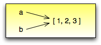

.. $Id: capitulo_08.rst,v 2.3 2007-04-24 03:58:31 luciano Exp $

==================
Capítulo 8: Listas
==================

.. contents:: Tópicos

Uma **lista** é um conjunto ordenado de valores, onde cada valor é identificado por um índice. Os valores que compõem uma lista são chamados **elementos**. Listas são similares a strings, que são conjuntos ordenados de caracteres, com a diferença que os elementos de uma lista podem possuir qualquer tipo. Listas e strings XXX e outras coisas que se comportam como conjuntos ordenados XXX são chamados **seqüências**.

-------------------------------
8.1 Valores da lista
-------------------------------

Existem várias maneiras de criar uma nova lista; a mais simples é envolver os elementos em colchetes (``[`` e ``]``)::

  >>> [10, 20, 30, 40]
  >>> ['spam', 'bungee', 'swallow']

O primeiro exemplo á uma lista de quatro inteiros. O segundo é uma lista de três strings. Os elementos de uma lista não necessitam ser do mesmo tipo. A lista a seguir contém uma string, um valor *float*, um valor inteiro, e *mirabile dictu* uma outra lista::

  >>> ['alo', 2.0, 5, [10,20]]

Uma lista dentro de outra lista é dita estar **aninhada**.

Listas que contém inteiros consecutivos são comuns, então Python fornece uma maneira simples de criá-los::

  >>> range(1,5)
  [1, 2, 3, 4]

A função ``range`` pega dois argumentos e devolve uma lista que contém todos os inteiros do primeiro até o segundo, incluindo o primeiro mas não incluindo o segundo!

Existem outras formas de ``range``. Com um argumento simples, ela cria uma lista que inicia em 0::

  >>> range(10)
  [0,1, 2, 3, 4, 5, 6, 7, 8, 9]

Se existe um terceiro argumento, ele especifica o espaço entre os valores sucessivos, que é chamado de ``tamanho do passo``. Este exemplo conta de 1 até 10 em passos de 2::

  >>> range(1, 10, 2)
  [1, 3, 5, 7, 9]

Finalmente, existe uma lista especial que não contém elementos. Ela é chamada lista vazia, e sua notação é ``[]``.

Com todas estas formas de criar listas, seria decepcionante se não pudéssemos atribuir valores de listas a variáveis ou passar listas como parâmetros a funções. Felizmente, podemos.

::

    >>> vocabulario = ['melhorar', 'castigar', 'defenestrar']
    >>> numeros = [17, 123]
    >>> vazio = []
    >>> print vocabulario, numeros, vazio
    ['melhorar', 'castigar', 'defenestrar'] [17, 123] []

-------------------------
8.2 Acessado elementos
-------------------------

A sintaxe para acessar os elementos de uma lista é a mesma que a sintaxe para acessar os caracteres de uma string XXX o operator colchete (``[]``). A expressão dentro dos colchetes especifica o índice. Lembre-se que os índices iniciam em 0::

    >>> print numeros[0]
    >>> numeros[1]= 5

O operador colchete pode aparecer em qualquer lugar em uma expressão. Quando ele aparece no lado esquerdo de uma atribuição, ele modifica um dos elementos em uma lista, de forma que o um-ésimo elemento de ``numeros``, que era ``123``, é agora ``5``.

Qualquer expressão inteira pode ser utilizada como um índice::

    >>> numeros[3-2]
    5
    >>> numeros[1.0]
    TypeError: sequence index must be integer

Se você tentar ler ou escrever um elemento que não existe, você recebe um erro de tempo de execução (*runtime error*)::

    >>> numeros[2]=5
    IndexError: list assignment index out of range

Se um índice possui um valor negativo, ele conta ao contrário a partir do final da lista::

    >>> numeros[-1]
    5
    >>> numeros[-2]
    17
    >>> numeros[-3]
    IndexError: list index out of range

``numeros[-1]`` é o último elemento da lista, ``numeros[-2]`` é o penúltimo e ``numeros[-3]`` não existe.

É comum utilizar uma variável de laço como um índice da lista::

    >>> cavaleiros = ['guerra', 'fome', 'peste', 'morte']
    i = 0
    while i < 4: 
        print cavaleiros[i]
        i = i + 1

Este laço ``while`` conta de 0 até 4. Quando a variável do laço ``i`` é 4, a condição falha e o laço se encerra. Desta forma o corpo do laço é executado somente quando ``i`` é 0, 1, 2 e 3.

Em cada vez dentro do laço, a variável ``i`` é utilizada como um índice para a lista, exibindo o ``i-ésimo`` elemento. Este padrão de computação é chamado de **percurso na lista**.

---------------------------
8.3 Comprimento da lista
---------------------------

A função ``len`` devolve o comprimento de uma lista. É uma boa idéia utilizar este valor como o limite superior de um laço ao invés de uma constante. Desta forma, se o tamanho da lista mudar, você não precisará ir através de todo o programa modificando todos os laços; eles funcionarão corretamente para qualquer tamanho de lista::

    >>> cavaleiros = ['guerra', 'fome', 'peste', 'morte']
    i = 0
    while i < len(cavaleiros):
        print cavaleiros[i]
        i = i + 1

A última vez que o corpo do laço é executado, ``i`` é ``len(cavaleiros) - 1``, que é o índice do último elemento. 
Quando ``i`` é igual a ``len(cavaleiros)``, a condição falha e o corpo não é executado, o que é uma boa coisa, porque ``len(cavaleiros)`` não é um índice legal.

Embora uma lista possa conter uma outra lista, a lista aninhada ainda conta como um elemento simples. O comprimento desta lista é quatro::

    >>> [`spam!', 1, ['Brie', 'Roquefort', 'Pol lê Veq'], [1, 2 3]]

..

  Como um exercício, escreva um laço que percorra a lista anterior e exiba o comprimento de cada elemento. O que acontece se você manda um inteiro para ``len``?

---------------------------------------------------
8.4 Membros de uma lista 
---------------------------------------------------

``in`` é um operador lógico que testa se um elemento é membro de uma seqüência. Nós o utilizamos na ``Seção 7.10`` com strings, mas ele também funciona com listas e outras seqüências::

    >>> cavaleiros = ['guerra', 'fome', 'peste', 'morte']
    >>> 'peste' in cavaleiros
    True
    >>> 'depravação' in cavaleiros
    False

Uma vez que 'peste' é um membro da lista ``cavaleiros``, o operador ``in`` devolve ``verdadeiro``. Uma vez que ``depravação`` não está na lista, ``in`` devolve ``falso``.

Podemos utilizar também o ``not`` em combinação com o ``in`` para testar se um elemento não é um membro de uma lista::

    >>> ``depravação`` not in cavaleiros
    True

-----------------------------------------------------
8.5 Listas e laços ``for``
-----------------------------------------------------

O laço ``for`` que vimos na Seção 7.3 também funciona com listas. A sintaxe generalizada de um laço ``for`` é::

    for VARIAVEL in LISTA:
        CORPO

Esta declaração é equivalente a::

    >>> i = 0
    >>> while i < len(LISTA):
    >>>   VARIAVEL = LISTA[i]
    >>>   XXX BODY
    >>>   i = i + 1

O laço ``for`` é mais conciso porque podemos eliminar a variável do laço, ``i``. Aqui está o laço anterior escrito com um`laço ``for``::

    >>> for cavaleiro in cavaleiros:
        print cavaleiro

Quase se lê como Português: "For (para cada) cavaleiro in (na lista de) cavaleiros, print (imprima o nome do) cavaleiro."

Qualquer expressão de lista pode ser utilizada num laço ``for``::

    >>> for numero in range(20):
        if numero % 2 == 0:
            print numero

    >>> for fruta in ["banana", "abacaxi", "laranja"]:
        print "Eu gosto de comer " + fruta + "s!"

O primeiro exemplo exibe todos os números pares entre zero e dezenove. O segundo exemplo expressa o entusiasmo por várias frutas.

-------------------------
8.6 Operações em listas
-------------------------

O operador ``+``  concatena listas::

    >>> a = [1, 2, 3]
    >>> b = [4, 5, 6]
    >>> c = a + b
    >>> print c
    [1, 2, 3, 4, 5, 6]

Similarmente, o operador ``*``  repete uma lista um número dado de vezes::

    >>> [0] * 4
    [0, 0, 0, 0]
    >>> [1, 2, 3] * 3
    [1, 2, 3, 1, 2, 3, 1, 2, 3]

O primeiro exemplo repete ``[0]`` quatro vezes. O segundo exemplo repete a lista ``[1, 2, 3]`` três vezes.

----------------------------------------
8.7 Fatiamento de listas
----------------------------------------

A operação de fatiamento que vimos na Seção 7.4 também funciona sobre listas::

    >>> lista = ['a', 'b', 'c', 'd', 'e', 'f']
    >>> lista[1:3]
    ['b', 'c']
    >>> lista[:4]
    ['a', 'b', 'c', 'd']
    >>> lista[3:]
    ['d', 'e', 'f']
    >>> lista[:]
    ['a', 'b', 'c', 'd', 'e', 'f']

--------------------------
8.8 Listas são mutáveis
--------------------------

Diferente das strings, as listas são mutáveis, o que significa que podemos modificar seus elementos. Utilizando o operador colchete no lado esquerdo de uma atribuição, podemos atualizar um de seus elementos::

    >>> fruta = ["banana", "abacaxi", "laranja"]
    >>> fruta[0] = "abacate"
    >>> fruta[-1] = "tangerina"
    >>> print fruta
    ['abacate', 'abacaxi', 'tangerina']

Com o operador de fatiamento podemos atualizar vários elementos de uma vez::

    >>> lista = ['a', 'b', 'c', 'd', 'e', 'f']
    >>> lista[1:3] = ['x', 'y']
    >>> print lista
    ['a', 'x', 'y', 'd', 'e', 'f']

Também podemos remover elementos de uma lista atribuindo a lista vazia a eles::

    >>> lista = ['a', 'b', 'c', 'd', 'e', 'f']
    >>> lista[1:3] = []
    >>> print lista
    ['a', 'd', 'e', 'f']

E podemos adicionar elementos a uma lista enfiando-os numa fatia vazia na posição desejada::

    >>> lista = ['a', 'd', 'f']
    >>> lista[1:1] = ['b', 'c']
    >>> print lista
    ['a', 'b', 'c', 'd', 'f']
    >>> lista[4:4] = ['e']
    >>> print lista
    ['a', 'b', 'c', 'd', 'e', 'f']

---------------------------------
8.9 Remoção em lista
---------------------------------

Utilizando fatias para remover elementos pode ser complicado, e desta forma propenso a erro. Python fornece uma alternativa que é mais legível.

``del`` remove um elemento de uma lista::

    >>> a = ['um', 'dois', 'tres']
    >>> del a[1]
    >>> a
    ['um', 'tres']

Como você deveria esperar, ``del`` trata valores negativos e causa erros de tempo de execução se o índice estiver fora da faixa.

Você também pode utilizar uma faixa como um índice para ``del``::

    >>> lista = ['a', 'b', 'c', 'd', 'e', 'f']
    >>> del lista[1:5]
    >>> print lista
    ['a', 'f']

Como de costume, fatias selecionam todos os elementos até, mas não incluindo, o segundo índice.

---------------------------------
8.10 Ojetos e valores
---------------------------------

Se executamos estas declarações de atribuição::

    >>> a = "banana"
    >>> b = "banana"

sabemos que ``a`` e ``b`` se referem a uma string com as letras ``banana``. Mas não podemos dizer se elas apontam para *a mesma* string.

Existem dois possíveis estados:

.. image:: fig/08_01_lista1.png

Em um caso, ``a`` e ``b`` se referem a duas coisas diferentes que possuem o mesmo valor. No segundo caso, elas se referem à mesma coisa. Estas "coisas" possume nomes - elas são chamadas **objetos**. Um objeto é algo ao qual uma variável pode se referenciar.

Todo objeto possui um **identificador** único, que podemos obter com a função ``id``. Exibindo o identificador de ``a`` e ``b``, podemos dizer se elas se referem ao mesmo objeto.

::

    >>> id(a)
    135044008
    >>> id(b)
    135044008

De fato, obtivemos o mesmo identificador duas vezes, o que significa que Python criou apenas uma string, e tanto ``a`` quanto ``b`` se referem a ela.

Interessantemente, listas se comportam de forma diferente. Quando criamos duas listas, obtemos dois objetos::

    >>> a = [1, 2, 3]
    >>> b = [1, 2, 3]
    >>> id(a)
    135045528
    >>> id(b)
    135041704

Então o diagrama de estado fica assim:

.. image:: fig/08_02_lista2.png

``a`` e ``b`` possuem o mesmo valor mas não se referem ao mesmo objeto.

-----------------------------------------------
8.11 Apelidos 
-----------------------------------------------

Uma vez que variáveis se referem a objetos, se atribuimos uma variável a uma outra, ambas as variáveis se referem ao mesmo objeto::

    >>> a = [1, 2, 3]
    >>> b = a

Neste caso,  o diagrama de estado se parece com isto:

Uma vez que a lista possui dois nomes diferentes, ``a`` e ``b``, dizemos que ela está "apelidada" (aliased). Mudanças feitas em um apelido afetam o outro nome::

    >>> b[0] = 5
    >>> print a
    [5, 2, 3]

Embora este comportamento possa ser útil, ele é às vezes inesperado e indesejado. Em geral, é mais seguro evitar os apelidos quando você está trabalhando com objetos mutáveis. É claro, para objetos imutáveis, não há problema. É por isto que Python é livre para apelidar cadeias de caracteres quando vê uma oportunidade de economizar.

------------------------------
8.12 Clonando listas
------------------------------

Se queremos modificar uma lista e também manter uma cópia da original, preciamos ter condições de fazer uma cópia da própria lista, não apenas uma referência. Este processo é algumas vezes chamado **clonagem**, para evitar a ambigüidade da palavra "cópia".

A maneira mas fácil de clonar uma lista é utilizar o operador de fatia::

    >>> a = [1, 2, 3]
    >>> b = a[:]
    >>> print b
    [1, 2, 3]

Pegar qualquer fatia de ``a`` cria uma nova lista. Neste caso acontece da fatia consistir da lista inteira.

Agora estamos livres para fazer alterações a ``b`` sem nos preocuparmos com``a``::

    >>> b[0] = 5
    >>> print a
    [1, 2, 3]

..

  Como exercício, desenhe um diagrama de estado para``a`` e ``b`` antes e depois desta mudança.

--------------------------------
8.13 Lista como parâmetro
--------------------------------

Passar uma lista como um argumento passa realmente uma referência à lista, não uma cópia da lista. Por exemplo, a função ``cabeca`` pega uma lista como parâmetro e devolve a cabeça da lista, ou seja, seu primeiro elemento::

    >>> def cabeca(lista):
        return lista[0]

Eis como ela é utilizada::

    >>> numeros = [1, 2, 3]
    >>> cabeca(numeros)
    1

O parâmetro ``lista`` e a variável ``numeros`` são apelidos para o mesmo objeto. O diagrama de estado se parece com isto:

.. image:: fig/08_04_pilha5.png

Uma vez que o objeto é compartilhado pelos dois quadros, o desenhamos entre eles.

Se a função modifica um parâmetro da lista, a função chamadora vê a mudança. Por exemplo, ``removeCabeca`` remove o primeiro elemento da lista::

    >>> def removeCabeca(lista):
        del lista[0]

Aqui está a maneira como ela é utilizada::

    >>> numeros = [1, 2, 3]
    >>> removeCabeca(numeros)
    >>> print numeros
    [2, 3]

Se uma função devolve uma lista, ela devolve uma referência à lista. Por exemplo, ``cauda`` devolve uma lista que contém todos menos o primeiro elemento de uma determinada lista::

    >>> def cauda(lista):
        return lista[1:]

Aqui está a maneira como ela é utilizada::

    >>> numeros = [1, 2, 3]
    >>> resto = cauda(numeros)
    >>> print resto
    [2, 3]

Uma vez que o valor de retorno foi criado com o operador de fatia, ele é uma nova lista. A criação de ``resto``, e qualquer alteração subseqüente a ``resto``, não tem efeito sobre ``numeros``.

------------------------------
8.14 Lista aninhadas
------------------------------

Uma lista aninhada é uma lista que aparece como um elemento de uma outra lista. Nesta lista, o terceiro elemento é uma lista aninhada::

    >>> lista = ["alo", 2.0, 5, [10, 20]]

Se exibimos ``lista[3]``, obtemos ``[10, 20]``. Para extrairmos um elemento de uma lista aninhada, podemos agir em duas etapas::

    >>> elem = lista[3]
    >>> elem[0]
    10

Ou podemos combiná-las::

    >>> lista[3][1]
    20 

Os operadores colchete avaliam da esquerda para a direita, então a expressão pega o terceiro elemento de ``lista`` e extrai o primeiro elemento dela.

--------------------------
8.15 Matrizes
--------------------------

Listas aninhadas são freqüentemente utilizadas para representar matrizes. Por exemplo, a matriz:

poderia ser representada como::

    >>> matriz = [[1, 2, 3], [4, 5, 6], [7, 8, 9]]

``matriz`` é uma lista com três elementos, onde cada elemento é uma linha da matriz. Podemos selecionar uma linha inteira da matriz da maneira habitual::

    >>> matriz[1]
    [4, 5, 6]

Ou podemos extrair um único elemento da matriz utilinado a forma de duplo índice::

    >>> matriz[1][1]
    5

O primeiro índice seleciona a linha, e o segundo índice seleciona a coluna. Embora esta maneira de representar matrizes seja comum, ela não é a única possibilidade. Uma pequena variação é utilizar uma lista de colunas ao invés de uma lista de linhas. 

Mais adiante veremos uma alternativa mais radical utilizando um dicionário.

------------------------------------------
8.16 Strings e listas
------------------------------------------

Duas das mais úteis funções no módulo ``string`` envolvem listas de strings. A função ``split`` (separar) quebra uma string em uma lista de palavras. Por padrão, qualquer número de caracteres espaço em branco é considerado um limite de uma palavra:: 

    >>> import string
    >>> poesia = "O orvalho no carvalho..."
    >>> string.split(poesia)
    ['O', 'orvalho', 'no', 'carvalho...']

Um argumento opcional chamado um **delimitador** pode ser utilizado para especificar qual caracter utilizar como limites da palavra. O exemplo a seguir utiliza a string ``va``:: 

    >>> string.split(poesia, 'va')
    ['O or', 'lho no car', 'lho...']

Perceba que o delimitador não aparece na lista.

A função ``join`` (juntar) é o inverso de ``split``. Ela pega uma lista de strings e concatena os elementos com um espaço entre cada par::

    >>> lista = ['O', 'orvalho', 'no', 'carvalho...']
    >>> string.join(lista)
    'O orvalho no carvalho...'

Como ``split``, ``join`` recebe um delimitador que é inserido entre os elementos::

    >>> string.join(lista, '_')
    'O_orvalho_no_carvalho...'
    
..

  Como um execício, descreva o relacionamento entre ``string.join(string.split(poesia))`` e ``poesia``. Eles são o mesmo para qualquer string? Quando eles seriam diferentes?

-----------------
8.17 Glossário
-----------------

lista (*list*)
    Uma coleção *denominada* de objetos, onde cada objeto é identificado por um índice.

índice (*index*)
    Uma variável inteira ou valor que indica um elemento de uma lista.

elemento (*element*)
    Um dos valores em uma lista(ou outra seqüência). O operador colchete seleciona elementos de uma lista.

seqüência (*sequence*)
    Qualquer um dos tipos de dados que consiste de um conjunto ordenado de elementos, com cada elemento identificado por um índice.

lista aninhada (*nested list*)
    Uma lista que é um elemento de uma outra lista.

percurso na lista (*list traversal*)
    O acesso seqüencial de cada elemento em uma lista.

objeto (*object*)
    Um coisa a qual uma variável pode se referir.

apelidos (*aliases*)
    Múltiplas variáveis que contém referências ao mesmo objeto.

clonar (*clone*)
    Criar um novo objeto que possui o mesmo valor de um objeto existente. Copiar a referência a um objeto cria um apelido (*alias*) mas não clona o objeto.

delimitador (*delimiter*)
    Um caracter uma string utilizados para indicar onde uma string deveria ser dividida(*split*).

----------------------------------------
Outros termos utilizados neste capítulo 
----------------------------------------
**(XXX esta lista deve ser retirada na versão final)**

XXX *has, have*
    possuir (ter?)

XXX *there is, there are*
    existir (haver?)

XXX *use*
    utilizar (usar?)

XXX string
    Utilizei string em itálico, por ser tratar de um termo que não é em português.

XXX *enclose*
    envolver???

XXX *provide*
    fornecer

XXX *return*
    devolve

XXX *denoted*
    denotada XXX

XXX *disappointing*
    decepcionante (desapontador?)

XXX *assign*
    atribuir

XXX *change*
    modificar

XXX *length*
    comprimento (tamanho?)

XXX *print*
    exibir (imprimir?)

XXX *membership*
    Não creio que exista uma palavra que traduza este termo. Pelo menos em inglês não encontrei nenhum sinônimo. Vou tentar traduzir explicando o termo dependendo do contexto.

XXX *boolean* 
    lógico (booleano?)

*XXX handle*
    tratar

*XXX proceed*
    agir

*XXX By default*
    por padrão

*XXX notice*
    perceber (observar?)

XXX *mirabile dictu*
    Alguém tem idéia do que significa isto? Meu latim não chegou lá. :)

XXX *traduzir os exemplos?*
    considero melhor fazer a traduzir os exemplos sempre que possível. Só não gostaria de tirar o espírito que levou o autor a utilizar tais exemplos. Podem haver trocadilhos, homenagens e outros sentimentos no autor que não devemos retirar. Desta forma, estou traduzindo todos os termos que consigo entender e encontrar palavras que exprimam a idéia. Nos demais, estou mantendo os termos originais para uma discussão futura.
