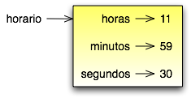

.. $Id: capitulo_13.rst,v 2.3 2007-04-26 04:44:56 luciano Exp $

==============================
Capítulo 13: Classes e funções
==============================

.. contents:: Tópicos

-------------
13.1 Horario
-------------
 
Como exemplo de outro tipo definido pelo usuário, vamos definir uma classe chamada ``Horario`` que grava os registros de horário do dia. Eis a definição da classe::

    class Horario: 
        pass 

Podemos criar uma nova instância de ``Horario`` e determinar atributos para horas, minutos e segundos::

    horario = Horario() 
    horario.horas = 11 
    horario.minutos = 59 
    horario.segundos = 30 

O diagrama de estado para o objeto ``Horario`` parece com isso:

..

  Como exercício, escreva uma função 'imprimirHorario' que tenha como argumento um objeto Horario e imprima-o na forma horas:minutos:segundos.

  Como um segundo exercício, escreva uma função booleana que tenha como argumento dois objetos Horario, h1 e h2, e retorne verdadeiro (1) se h1 vem depois de h2 cronologicamente, do contrário, retorne falso (0).
 
-------------------
13.2 Funções Puras
------------------- 

Nas próximas sessões, vamos escrever duas versões de uma função chamada ``adicionaHorario``, que calcula a soma de dois horários. Elas vão demonstrar 2 tipos de funções: funções puras e funções modificadoras. 

Segue uma versão tosca de ``somaHorario``::

  def somaHorario(h1, h2): 
    soma = Horario() 
    soma.horas = h1.horas + h2.horas 
    soma.minutos = h1.minutos + h2.minutos 
    soma.segundos = h1.segundos + h2.segundos 
    return soma 

A função cria um novo objeto ``Horario``, inicializa os seus atributos, e retorna uma referência para o novo objeto. Isso é chamado de função pura pois ela não modifica nenhum dos objetos que são passados como parâmetros e não tem nenhum efeito colateral, como imprimir um valor ou pegar entrada do usuário. 

Aqui está um exemplo de como usar esta função. Nós vamos criar dois objetos ``Horario``: ``horarioAtual``, que contém o horário atual; e ``horarioDoPao``, que contém a quantidade de tempo que a máquina de fazer pão gasta para fazer pão. Então  vamos usar ``somaHorario`` para tentar saber quando o pão estará pronto. Se você não tiver terminado de escrever ``imprimirHorario`` ainda, de uma olhada na seção 14.2 antes de você continuar isso:: 

    >>> horarioAtual = Horario() 
    >>> horarioAtual.horas = 9 
    >>> horarioAtual.minutos = 14 
    >>> horarioAtual.segundos =  30 
 
    >>> horarioDoPao = Horario() 
    >>> horarioDoPao.horas =  3 
    >>> horarioDoPao.minutos =  35 
    >>> horarioDoPao.segundos =  0 
 
    >>> horarioTermino = somaHorario(horarioAtual, horarioDoPao) 
    >>> imprimirHorario(horarioTermino) 

A saída deste programa é 12:49:30, o que é correto. Por outro lado, existem casos onde o resultado não é correto. Você pode pensar em algum ?

O problema é que esta função não lida com casos onde o número de segundos ou minutos é acrescentado em mais de sessenta. Quando isso acontece, temos de "transportar" os segundos extras para a coluna dos minutos ou os minutos extras na coluna das horas.

Aqui está a segunda versão corrigida da função::

    def somaHorario(t1, t2): 
        soma = Horario() 
        soma.horas = t1.horas + t2.horas 
        soma.minutos = t1.minutos + t2.minutos 
        soma.segundos = t1.segundos + t2.segundos 

        if soma.segundos >= 60: 
            soma.segundos = soma.segundos - 60 
            soma.minutos = soma.minutos + 1 

        if soma.minutos >= 60: 
            soma.minutos = soma.minutos - 60 
            soma.horas = soma.horas + 1 

        return soma 

Apesar desta função estar correta, ela está começando a ficar grande. Depois vamos sugerir uma aproximação alternativa que rende um código menor. Clique aqui para feedback

------------------- 
13.3 Modificadores
------------------- 
 
Existem momentos quando é útil para uma função modificar um ou mais dos objetos que ela recebe como parâmetro. Usualmente, quem está chamando a função mantém uma referência para os objetos que ele passa, de forma que quaisquer mudanças que a função faz são visíveis para quem está chamando. Funções que trabalham desta forma são chamadas modificadores. 

``incrementar``, que adiciona um número dado de segundos para um objeto Horario, que poderia ser escrito quase naturalmente como um modificador. Um rascunho tosco da função seria algo parecido com isso::

    def incrementar(horario, segundos): 
        horario.segundos = horario.segundos + segundos 

        if horario.segundos >= 60: 
            horario.segundos = horario.segundos - 60 
            horario.minutos = horario.minutos + 1 

        if horario.minutos >= 60: 
            horario.minutos = horario.minutos - 60 
            horario.horas = horario.horas + 1 

A primeira linha executa a operação básica; o resto lida com os caso especiais que vimos antes. 

Esta função esta correta ? O que aconteceria se o parametro segundos for muito maior que sessenta ? Nesse caso, não é suficiente transportar apenas uma vez; teríamos de continuar fazendo isso até que segundos seja menor que sessenta. Uma solução seria substituir os comando if por comandos while::

    def incrementar(horario, segundos): 
        horario.segundos = horario.segundos + segundos 

        while horario.segundos >= 60: 
            horario.segundos = horario.segundos - 60 
            horario.minutos = horario.minutos + 1 

        while horario.minutos >= 60: 
            horario.minutos = horario.minutos - 60 
            horario.horas = horario.horas + 1 

Esta função agora esta correta, mas não é a solução mais eficiente. 

Como um exercício, reescreva esta função de maneira que ela não contenha nenhum loop. Como um segundo exercício, reescreva ``incrementar`` como uma função pura, e escreva chamadas de funções para as duas funções. Clique aqui para feedback
 
-----------------------
13.4 O que é melhor ?
-----------------------

Qualquer coisa que pode ser feita com modificadores também podem ser feitas com funções puras. De fato, algumas linguagens de programação permitem apenas funções puras. Existe alguma evidência que programas que usam funções puras são desenvolvidos mais rapidamente e são menos propensos a erros que programas que usam modificadores. No entanto, modificadores as vezes são convenientes, e em alguns casos, programação funcional é menos eficiente. 

Em geral, recomendamos que você escreva funções puras sempre que for necessário e recorrer para modificadores somente se existir uma grande vantagem. Esta aproximação poderia ser chamada de um estilo de programação funcional. Clique aqui para feedback

---------------------------------------------------------------------
13.5 Desenvolvimento Prototipado versus Desenvolvimento Planejamento
---------------------------------------------------------------------

Neste capítulo, demonstramos uma aproximação para o desenvolvimento de programas que chamamos de desenvolvimento prototipado. Em cada caso, escrevemos um rascunho tosco (ou prototipo) que executou os cálculos básicos e então, o testamos em uns poucos casos, corrigindo então, as falhas que fomos encontrando. 

Embora esta aproximação possa ser eficaz, ela pode conduzir para código que é desnecessariamente complicado desde que trata de muitos casos especiais e não confiáveis desde que é difícil saber se você encontrou todos os erros.

An alternative is planned development, in which high-level insight into the problem can make the programming much easier. In this case, the insight is that a Time object is really a three-digit number in base 60! The second component is the "ones column," the minute component is the "sixties column," and the hourcomponent is the "thirty-six hundreds column." 

When we wrote addTime and increment, we were effectively doing addition in base 60, which is why we had to carry from one column to the next. 

This observation suggests another approach to the whole problem     we can convert a Time object into a single number and take advantage of the fact that the computer knows how to do arithmetic with numbers. The following function converts a Timeobject into an integer::

  def converterParaSegundos(t): 
    minutos = t.horas * 60 + t.minutos 
    segundos = minutos * 60 + t.segundos 
    return segundos

Agora, tudo que precisamos é uma maneira de converter de um inteiro para um objeto ``Horario``::

 def criarHorario(segundos): 
     horario = Time() 
     horario.horas = segundos/3600 
     segundos = segundos - horario.horas * 3600 
     horario.minutos = segundos/60 
     segundos = segundos - horario.minutos * 60 
     horario.segundos = segundos 
     return horario 

Você deve ter que pensar um pouco para se convencer que esta técnica de converter de uma base para outra é correta. Assumindo que você está convencido, você pode usar essas funções para reescrever somaHorario::

 def somaHorario(t1, t2): 
     segundos = converterParaSegundos(t1) + converterParaSegundos(t2) 
     return criarHorario(segundos)

Esta versão é muito mais curta que a original, e é muito mais fácil para demonstrar que está correta (assumindo,  como sempre, que as funções que são chamadas estão corretas). 

Como um exercício, reescreva ``incrementar`` da mesma forma. 
Clique aqui para feedback
 

--------------------
13.6 Generalização
--------------------

Algumas vezes, converter de base 60 para base 10 e voltar é mais difícil do que simplesmente lidar com horários. Conversão de base é mais abstrata; nossa intuição para lidar com horários é melhor. 

Mas se XXXX But if we have the insight to treat times as base 60 numbers and make the investment of writing the conversion functions (converterParaSeguntos e criarHorario), nós conseguimos um programa que é menor, fácil de ler e depurar, e mais confiável. 

É também fácil para adicionar funcionalidades depois. Por exemplo, imagine subtrair dois Horarios para encontrar a duração entre eles. Uma aproximação ingênua seria implementar subtração com empréstimo (?? borrowing - Isso mesmo ??). Usando as funções de conversão será mais fácil e provavelmente estará correto. 

Ironicamente, algumas vezes fazer um problema mais difícil (ou mais genérico) o torna mais simples (porque existem alguns poucos casos especiais e poucas oportunidades para errar). Clique aqui para feedback

-----------------
13.7 Algoritmos
-----------------

Quando você escreve uma solução genérica para uma classe de problemas, ao contrário de uma solução específica para um único problema, você escreveu um algorítmo. Nós mencionamos isso antes mas não definimos cuidadosamente. Isso não é fácil para definir, então nós vamos tentar //a couple of approaches//. 

Primeiramente, considere alguma coisa que não seja um algorítmo. Quando você aprendeu a multiplicar números de um dígito, você provavelmente memorizou a tabela de multiplicação. Como resultado, você memorizou 100 soluções específicas. Esse tipo de conhecimento não é algorítmo. 

Mas se você é "preguiçoso", você provavelmente trapaceou por ter aprendido alguns truques. Por exemplo, para encontrar o produto de n e 9, você pode escrever n-1 como o primeiro dígito e 10-n como o segundo dígito. Esse truque é uma solução genérica para multiplicar qualquer número de um dígito por 9. Isso é um algoritmo! 

De modo parecido, as técnicas que você aprendeu para adicionar //com transporte//, //subtraction with borrowing//, e divisão longa são todas algorítmos. Uma das características dos algorítmos é que eles não requerem nenhuma inteligência para  serem executados ( carry out ). Eles são processos mecânicos  no qual cada passo segue o último de acordo com um conjunto simples de regras. 

Na nossa opinião, é preocupante que humanos gastem tanto tempo na escola aprendendo a executar algoritmos que, literalmente, não requerem inteligência.

Por outro lado, o processo de projetar algoritmos é interessante, intelectualmente desafiante, e uma parte central daquilo que chamamos programação. 

Algumas das coisas que as pessoas fazem naturalmente, sem dificuldade ou consciência, são as mais difíceis de se expressar através de algoritmos. Entender a linguagem natural é um bom exemplo. Todos nós fazemos isso, mas até hoje ninguém conseguiu explicar como fazemos isso, pelo menos não na forma de algoritmo. Clique aqui para feedback.

---------------
13.8 Glossário
---------------
 
função pura (*pure function*)
 Uma função que não modifica nenhum dos objetos que ela recebe como   
 parâmetro. A maioria das funções puras é frutífera. 

modificador (*modifier*)
 Uma função que muda um ou mais dos objetos que ela recebe como 
 parâmetros. A maioria dos modificadores é nula. 

estilo de programação funcional (*functional programming style*)
 Um estilo de programação onde a maioria das funções são puras. 

desenvolvimento prototipado (*prototype development*)
 Uma maneira de desenvolver programas começando com um protótipo e gradualmente melhorando-o. 

desenvolvimento planejado (*planned development*)
 Uma maneira de desenvolver programas que envolvem uma percepção de alto nível do problema e mais planejamento do que desenvolvimento incremental ou desenvolvimento prototipado. 

algoritmo (*algorithm*)
 Um conjunto de instruções para resolver uma classe de problemas usando  um processo mecânico, não inteligente.
